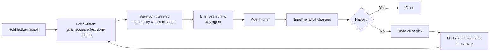

# Mewndo — Product Spec

> **Talk to any agent. Undo anything it does.**

| | |
|---|---|
| **Working name** | Mewndo (meow + undo). Alternatives in §15 |
| **Category** | Save points for AI agents |
| **Platform (v1)** | Cloud service + thin Windows agent + browser extension (see §19) |
| **Positioning** | Mewndo protects your stuff, not your computer |
| **Pitch** | If an agent touches your files or accounts, Mewndo can put it back |
| **Status** | v0 desktop app built · architecture reviewed 4 Oct 2026 (§19, §20) · Guard, Connect, Heal and fast models researched 5 Oct 2026 (§21–§27) · end-to-end architecture v2, Clef hosting and Flight Recorder (§28–§30) · detailed build plans (§31) |
| **Date** | 5 October 2026 |

---

## 1. Summary

AI agents (Claude Code, Cursor, Cowork, OpenClaw, Grok Bot, OpenAI dots, Manus) now act directly on people's files, inboxes and workspaces. When they go wrong, they go wrong fast, and the built-in undo features only cover a small slice of what agents touch.

Mewndo is a system-wide layer that sits where the user talks to *any* agent:

1. **Hold a key and speak.** Mewndo turns the ramble into a tight, scoped brief and pastes it into whichever agent is in focus.
2. **Before the agent starts**, Mewndo silently creates a **save point** of exactly what the brief says the agent will touch.
3. **After the agent runs**, the user sees what changed and can **undo all or part of it** in one click.
4. **Every undo teaches Mewndo a rule**, which is added to future briefs automatically.
5. **Continue any project anywhere.** Mewndo keeps a compact, verified "project card" (what you asked, what the agent did, what's left) and pastes it into dots, Grok Bot, Claude or a fresh session so the agent picks up in the right direction.

Two gestures carry the whole product: **one key to brief, one key to undo.**

It needs no API or integration from any agent vendor. It watches the data, not the agent, so it works the same whether the agent runs on your PC or in the cloud.

The visual identity comes from a cat game concept: each agent is a cat that gets heavier as its session bloats, leaps between rooftops (save points) and always lands back on its feet (undo).

---

## 2. The Problem

### 2.1 Agents are destroying real user data

| Date | Incident | Why native undo didn't help |
|---|---|---|
| Feb 2026 | An OpenClaw agent deleted 200+ emails from the inbox of Meta's director of alignment, ignoring "confirm before acting" and stop commands sent from her phone. Likely cause: context compaction dropped the instruction. | Gmail actions happen in the cloud; the agent has no undo for them. |
| Feb 2026 | Claude Cowork, asked to organise a desktop, deleted a folder holding roughly 15 years of family photos via terminal commands, bypassing the Trash (AI Incident Database #1441). Most were recovered only because iCloud happened to have copies. | Terminal deletes skip the Trash and checkpoints. |
| 2026 | Cowork GitHub issues: iCloud stub files copied then `rm -rf`'d, wiping cloud originals (#32637); on Windows 11, no working stop button, and deleting the task deleted the user's files (#67188). | Same. |
| Sep 2026 | Claude Code reportedly deleted 48,218 files in 103 seconds on Windows by mishandling directory junctions, also destroying the Git object store (reported via a since-deleted Reddit post). | Bash-level deletes are outside checkpointing; Git itself was destroyed. |

These incidents keep recurring every few weeks, across vendors, on both Mac and Windows, and in both local files and cloud accounts.

### 2.2 Native undo is narrow

- **Claude Code checkpointing** does not track files changed by Bash commands, and rewind doesn't undo edits made through connectors (Notion, Slack, GitHub). A request to expose restore programmatically was closed as "not planned."
- **Notion** undoes its own agent's edits, but version history lasts only 7 days (Free) or 30 days (Plus), restores are page-by-page, and the audit log that attributes changes is Enterprise-only.
- **Google** keeps the logs that name which OAuth app made a change, but only on Enterprise and Education editions. Consumer Gmail users get nothing.
- **Every vendor's undo covers only that vendor's agent.** Nobody offers one undo across all agents.

### 2.3 Meter shock and context bloat

- Grok Bot users report burning 77% of a Pro+ weekly allowance in 2 days, a week of Cursor Ultra usage lasting about 8 hours, and 99% of an allowance in 3 days.
- When Grok Bot's allowance runs out, usage spills onto Cursor credits and then on-demand billing.
- Neither xAI nor Cursor publishes usage as steps or tokens, so users can't predict cost before a task.
- A Grok Bot is one long conversation that re-reads itself every turn. Sessions get heavier and more expensive the longer they run, and users have no intuitive signal for when to start fresh.
- OpenAI dots usage is free for the first month after the 29 Sep 2026 launch; plan terms come after that, so the same shock is likely to reach dots users soon.

### 2.4 Cloud agents are fragile

- Grok Bot users repeatedly report the shared cloud computer getting stuck, which makes every bot fail at once, including freshly created ones.
- One user reported their Grok Bot computer silently restored to an older snapshot overnight, losing 3 days of files.
- Work that lives only inside an agent's cloud computer is at the mercy of that vendor's infrastructure.

### 2.5 People write bad briefs

- We ramble, forget edge cases and rarely state limits or what "done" means.
- Errors compound: at 95% accuracy per step, a 10-step task succeeds only about 60% of the time (0.95¹⁰ ≈ 0.60).
- Cursor's own advice to Grok Bot users is to scope tasks tightly and check the meter before big jobs. Few people do it consistently.

### 2.6 Agents lose the thread on long projects

- A Grok Bot is one long conversation; as it grows it gets slower and more expensive, and starting fresh means losing context.
- When long sessions are compacted, instructions can silently drop out. The inbox-deletion incident above is believed to have happened exactly this way: "confirm before acting" was lost.
- Each vendor's memory stays inside that vendor. Moving a project from Grok Bot to dots, or from a stuck bot to a new one, means re-explaining everything.
- Agent memory records what the agent *said*, not what it verifiably *did*. An agent that claims "done" when it isn't carries that error forward.

---

## 3. Who It's For

| Persona | Situation | What they get |
|---|---|---|
| **Windows power user / developer** | Runs Claude Code, Cursor, Codex or OpenClaw locally | Automatic save points; recovery from the next "48,000 files" moment |
| **Non-developer using desktop agents** | Uses Cowork-style agents to organise files, photos, documents | A safety net they never have to set up |
| **Cloud-agent power user** | Pays for Grok Bot, dots or Manus; agents touch Gmail, Drive, Notion | Cloud Rewind; outputs pulled out of fragile agent VMs; a visible "weight" signal |
| **Agency / small team** | Lets agents touch client files and workspaces | Shared audit trail of what agents did, per client |

**Beachhead:** Windows users running local agents. The Mac undo niche already has CoworkRestore; Windows has nothing comparable, and the founder's home market (India) is mostly Windows. Local file undo therefore ships at public launch via the thin Windows agent (§19.4), not after it.

### Coverage by agent

| Agent | Where it runs | What Mewndo does for it | Level of help |
|---|---|---|---|
| Claude Code, Cowork, Cursor, Codex, OpenClaw (desktop) | Your PC | Save points + one-key undo for every file change; briefs; Continue | **Huge** |
| Grok Bot | Its own cloud computer | Undo for Gmail/Drive/Notion changes; briefs; outputs saved to your folder (protects against VM rollbacks); connector holds on bulk deletes (supports MCP); Continue | **Moderate–high** |
| ChatGPT dots | Its own cloud computer | Undo for Gmail/Drive/Notion changes; briefs; outputs saved to your folder; Continue | **Moderate** |
| Manus | Its own cloud computer | Same as dots | **Moderate** |

**Never promised:** fixing vendor outages (a frozen Grok Bot computer, a dots outage), controlling vendor usage meters, or unsending emails an agent already sent.

---

## 4. Core Insight

**The voice brief is the backup trigger.**

| Who knows what | Intent (what the agent is about to do) | The data | Works across all agents |
|---|---|---|---|
| Agent platforms | Yes | Their own sandbox only | No |
| Backup tools | No | Yes | Yes, but admin-only and no agent awareness |
| Wispr-style dictation | Words only | No | Yes |
| **Mewndo** | **Yes** | **Yes** | **Yes** |

Mewndo is the only layer that sees **intent, action and correction together**. That makes the moat possible: **your agents learn from your undos.**

---

## 5. How It Works: The Loop



**Plain-text version:** speak → brief → save point → agent runs → review changes → undo if needed → the undo becomes a rule → the next brief is smarter.

**Long projects add a second loop:** the agent appends progress to your project log → Mewndo checks it against what actually changed → the project card updates → next session (any agent) starts with "continue Project X."

---

## 6. Features

Priority key: **P0** = MVP (month 1) · **P1** = month 2 · **P2** = month 3+

### A. Hotkey and voice brief (the "Flow" layer)

| ID | Feature | Description | Priority |
|---|---|---|---|
| F1 | Global hotkey | Hold-to-talk anywhere in Windows; configurable key; tap for text input instead of voice. | P0 |
| F2 | Speech-to-text | Default: streaming cloud STT (audio processed in memory, never stored; §19.5). Privacy mode: on-device Parakeet TDT 0.6B v3 (English) or Nemotron 3.5 (Hindi) in the thin agent (§16). **v0 uses Wispr Flow as the voice layer.** | P1 |
| F3 | Brief writer | Converts the ramble into a structured brief: **Goal · Scope** (folders/accounts) **· Rules** ("never delete, move only") **· Limits** (max steps, ask before X) **· Done criteria · Output location.** Shows the brief for a one-tap edit before pasting. | P0 |
| F4 | Universal injection | Pastes into the focused input via clipboard + simulated paste (Windows SendInput / UI Automation), then restores the user's original clipboard. No dependence on any vendor's UI structure. | P0 |
| F5 | Agent detection | Detects the focused app (Cursor, Claude, ChatGPT, Grok Bot, Manus, terminal) and adapts the brief's format and length to it. | P1 |
| F6 | Brief templates | Saved patterns for recurring jobs ("clean a folder", "triage inbox", "refactor module"). | P1 |

### B. Save points (local files)

| ID | Feature | Description | Priority |
|---|---|---|---|
| F7 | Intent-aware save points | Scope parsed from the brief → those folders are snapshotted **before** the user hits Enter. | P0 |
| F8 | Background agent watch | Detects agent processes (Claude Code, Cursor, Codex, OpenClaw, desktop agents) and creates save points automatically, even without a brief. | P0 |
| F9 | Snapshot engine | Volume Shadow Copy / copy-on-write / hard-link deduplication. Treats symlinks and directory junctions safely (lesson from the 48k-file incident). Sensible exclusions (`node_modules`, build caches) with user override. | P0 |
| F10 | Change timeline | "Since save point: 340 moved, 12 deleted, 28 edited", with per-file before/after preview. | P0 |
| F11 | Restore | Undo all, undo selected, or restore to a separate folder. Never overwrites newer edits by the user without asking. | P0 |
| F12 | Retention controls | Retention period and disk budget; oldest save points pruned first. | P1 |

### C. Rewind (cloud accounts)

| ID | Feature | Description | Priority |
|---|---|---|---|
| F13 | Account journaling | Append-only journal of changes via each app's own API. **Order: Notion → Gmail → Google Drive → GitHub/Slack.** Covers cloud agents (Grok Bot, dots, Manus) with no vendor hooks. | P1 (Notion), P2 (Google) |
| F14 | Burst detector | More than N deletes/archives/moves in M minutes → push alert with a "Revert this burst" button. | P1 |
| F15 | One-click burst revert | Uses Gmail un-trash, Drive revision restore and Notion page restore. | P1 |
| F16 | "Save outputs to Rewind" rule | Briefs for cloud agents include a rule to save every output to a Rewind folder in the user's Drive/GitHub/Notion, so work survives agent VM failures and rollbacks. | P1 |
| F17 | Connector (MCP) mode | For agents that accept custom connectors (Grok Bot supports MCP servers), routing through Mewndo gives exact attribution ("Grok Bot did this") and **holds bulk deletes until the user approves**. | P2 |
| F18 | Irreversible-action labels | Clearly marks what can't be undone (sent emails, payments, posted messages). For these, the only defence is the brief's "ask before" rules and connector holds, and the UI says so. | P1 |

### D. Memory

| ID | Feature | Description | Priority |
|---|---|---|---|
| F19 | Memory store | Preferences, stack ("React 19, strict TypeScript"), project facts, past decisions. Encrypted in the cloud so it follows the user across PC, browser and phone; kept on the device only in local-only mode. | P0 |
| F20 | Relevant injection | Only memory relevant to the current brief and agent is injected, to keep briefs short. | P0 |
| F21 | Undo-to-rule learning | A revert produces a suggested rule ("Don't touch photos when cleaning Downloads"). The user confirms before it's saved. | P1 |
| F22 | Highlight → save | Select an agent's output, press the hotkey, and decisions/facts are extracted into memory. | P1 |
| F23 | Export | Full memory export to Markdown/JSON. The user owns their data. | P1 |

### E. The cat (visual layer)

| ID | Feature | Game element → product meaning | Priority |
|---|---|---|---|
| F24 | One cat per agent | The cat is an agent run: "your Cursor cat", "your Grok Bot cat". | P0 |
| F25 | Weight = session size | The cat gets visibly chubbier and slower as context/usage grows. Exact where local logs expose usage; estimated (and labelled as estimated) elsewhere. | P1 |
| F26 | Fresh-start nudge | When the cat is too heavy to jump, Mewndo suggests a new session and writes a compact hand-off brief so no progress is lost. | P1 |
| F27 | Rooftops = save points | Each brief creates a new rooftop. A fall (agent mistake) lands the cat back on the last rooftop: that's undo. | P0 |
| F28 | Lives counter | Shows save points currently kept. | P0 |
| F29 | Shelf-knock alerts | "Your cat knocked 40 files off the shelf. Put them back?" for bulk-change alerts. | P0 |
| F30 | Finish line | The brief's done criteria shown as a checklist the cat runs toward. | P1 |
| F31 | Daily protection card | "Cursor changed 212 files today, all recoverable." Makes invisible protection visible, like an antivirus "threats blocked" count. | P0 |

### F. Team tier

| ID | Feature | Description | Priority |
|---|---|---|---|
| F32 | Shared audit log | What agents did, in which workspace, when, and what was reverted. | P2 |
| F33 | Per-client views/export | For agencies reporting agent activity on client data. | P2 |

### G. Privacy and security (non-negotiable)

- **Your files stay private, even from us:** local file contents and file names are end-to-end encrypted on the device before upload; Mewndo's servers store and sync them but cannot read them (§19.15).
- **Cloud accounts are server-readable by necessity:** Rewind workers must read Gmail, Drive and Notion to journal them; that data is encrypted at rest with per-user keys, and the security page says so plainly.
- **Audio is never stored**, and a **local-only mode** keeps everything on the PC.
- **Minimum OAuth scopes**; Google restricted-scope security assessment started in month 1.
- **No keystroke logging:** the app reads input only during an active hotkey session. Wispr Flow drew security concerns because its app can read keystrokes, so be explicit about this.
- Clear in-app statement of what Mewndo can and cannot undo.

### H. Continue (project memory)

Save points protect your data; **Continue is your save file** for progress. It restores a long project into any agent or a fresh session.

**Finding (Oct 2026):** neither dots nor Grok Bot provides reliable, continuous project logging over long background sessions. Continue is therefore built so that **the agent's own log is a bonus, never the foundation.**

**How Mewndo learns the project, most reliable first (no vendor API needed):**
1. **The journal (fully reliable):** what actually changed in files, Gmail, Drive and Notion. This is the backbone: "Done" means *verified changed*, not "agent said so."
2. **Your briefs (fully reliable):** everything sent through the hotkey is captured, so goals, rules and decisions never depend on the agent.
3. **Checkpoint on demand (pull, don't push):** at the moments that matter (Continue, end of session, cat too heavy), Mewndo pastes one short request, "Summarize progress in this format," and captures the reply. One fresh instruction is far more dependable than one the agent must keep following for hours.
4. **Updates agents already send:** dots sends progress updates and questions to its owner, including in Slack and Teams. Routing those to a channel Mewndo reads gives a progress log without asking the agent to write one.
5. **Highlight → save** (F22): key decisions grabbed straight from the chat.
6. **Connector mode** (F17): agents that accept MCP (Grok Bot, Claude) can read and write project memory directly.
7. **The agent's own progress log (best effort):** briefs still ask the agent to append to `PROJECT_LOG.md`. When it does, great; when it doesn't, nothing breaks.

**Every item on the card is labelled by source:**
- ✅ **Verified** (from the journal)
- 💬 **Agent says** (from checkpoints, updates or the log)
- ⚠️ **Mismatch** (the agent claimed it; the journal disagrees)

This turns agent unreliability into a selling point: Mewndo is the only memory that tells you when your agent's story doesn't match reality.

| ID | Feature | Description | Priority |
|---|---|---|---|
| F34 | Project card | Compact state of a project: **Goal · Decisions (and why) · Done (verified) · In progress · Next steps · Rules and don'ts · Where files live · Open questions.** Small enough to fit in one paste. | P1 |
| F35 | Progress-log rule (best effort) | Briefs auto-include the instruction to append progress notes to `PROJECT_LOG.md` in the user's folder. Treated as a bonus source only; Continue works without it. | P1 |
| F36 | Verified progress | Compares what the agent claims (checkpoints, updates, log) with what the journal shows actually changed. Every card item is labelled ✅ Verified, 💬 Agent says or ⚠️ Mismatch ("Agent says 10 files updated; 7 changed"). | P1 |
| F47 | Checkpoint on demand | At Continue, end of session or when the cat is too heavy, Mewndo pastes a one-line "summarize progress in this format" request into the agent and captures the reply. | P1 |
| F48 | Update-channel capture | Reads the progress updates agents already send (e.g. dots in Slack/Teams) from a channel the user chooses. | P2 |
| F37 | Continue hotkey | Say "continue Project X" → the card is pasted into whichever agent is in focus, or a brand-new session. | P1 |
| F38 | Connector memory tools | In connector mode, agents fetch the card and append progress themselves (e.g. `get_project_card`, `append_progress`). | P1 |
| F39 | Auto-updating card | After each session the card is rebuilt from the log, journal and highlights. The user can edit it; every version is kept. | P1 |
| F40 | Fresh-start pairing | When a cat gets too heavy (F25–F26), Mewndo offers to Continue in a new session: lean cat, full progress. This is the honest alternative to squeezing a bloated session. | P1 |
| F41 | Size budget | The card stays compact; older detail is archived and available on request (or via the connector), so the card never becomes the new bloat. | P1 |
| F42 | Multiple projects | Project list; Mewndo detects the current project from the focused folder or app. | P2 |

**Limit (stated in-app):** Mewndo can't read inside the dots or Grok Bot chat on its own. It learns from the journal, your briefs, on-demand checkpoints, update channels and connectors, and marks anything it can't verify as "Agent says."

### I. Speed and the two gestures

Wispr's product is one gesture. Mewndo has two: **one key to brief, one key to undo.**

| ID | Feature | Description | Priority |
|---|---|---|---|
| F43 | Continuous journaling | Watched folders are journaled continuously in the background, so a save point is just a bookmark in time. Zero wait; the user never sees "backing up…". | P0 |
| F44 | One-key undo | A configurable key (e.g. Ctrl+Alt+Z) opens "Undo the last agent burst", already selected. Press Enter. Done. | P0 |
| F45 | Streaming transcription | Speech is transcribed while the user talks, so releasing the key only triggers the brief-writing step. A "send raw" option skips it. | P0 |
| F46 | Phone keyboard and alerts | A Mewndo keyboard on iOS/Android for briefs and Continue in mobile agent apps; one-tap "Put it back" on cloud alerts. | P2 |

**Speed promises:**

| Action | Promise |
|---|---|
| Save point | Instant (a bookmark) |
| Brief pasted | ~1–2 seconds after you stop talking (engineering target) |
| Undo, local files | Seconds |
| Undo, Gmail/Drive/Notion | One tap; runs in the background with a progress bar, because those apps' servers set the pace |

**Taglines:** "One key to brief. One key to undo." · "Hold. Speak. Protected." · "Ctrl+Z for every AI agent."

---

## 7. What We Deliberately Don't Build

| Not building | Why |
|---|---|
| A context-compression proxy | Crowded: Headroom, Condense, Compresr's Context Gateway (YC W26), Paritok, agentgateway. It also breaks prompt caching if done naively, and summaries can hide failure signals; JetBrains Research found summarized context made agents take 13–15% longer. |
| Agent observability / guardrails for developers | Enterprise category; Cisco is acquiring Galileo; Honeycomb and Dynatrace are in it. |
| Handoff schema enforcement | Solved by structured outputs, A2A and gateway validation. |
| Dictation as the core product | Wispr raised $280M at a $2B valuation (Aug 2026) and already offers MCP access and Command Mode. Voice is our delivery mechanism, not the pitch. |
| The full open-world cat game | Use a 30-second browser version as the landing page instead (§10). |

---

## 8. Competitive Landscape

| Player | What it does | Gap Mewndo fills |
|---|---|---|
| Built-in checkpoints (Claude Code, Cursor) | Undo inside one tool, mostly for its own file edits | Misses Bash deletes and connector edits; one vendor only |
| Notion agent undo | Undo for Notion's own agent | Short history; other agents not covered |
| CoworkRestore | Local folder snapshots, Mac only, €19 one-time | No Windows, no cloud, no voice/brief, no memory |
| Agent Safehouse, bx | macOS sandboxes | Containment, not undo; Mac only |
| Afi, CloudAlly, SysCloud | Google Workspace backup, about $3–4/user/mo | Admin-only, minimums (SysCloud: 100 licences), no agent awareness, no consumer Gmail |
| Rubrik Agent Rewind, Veeam | Enterprise agent rollback | Enterprise pricing and sales only |
| Wispr Flow, Claude Code /voice, Cursor voice | Voice input | No save points, undo or rule learning |
| Cross-AI memory tools (agentage, MemX, etc.) | Shared memory across AI apps | No safety net; memory doesn't learn from undos; stores what agents *say*, not what they verifiably *did* |
| Pawse | Free pixel-art desktop cat that naps while agents run | Mascot only; no product mechanics |

---

## 9. Business Model

| Tier | Price | Includes |
|---|---|---|
| **Free** | ₹0 / $0 | Local save points (7-day retention), 20 briefs/day, 1 cloud account with 7-day journal, 1 Continue project, daily protection card |
| **Pro** | $8/mo · India price ₹399/mo · annual discount | Unlimited briefs, 90-day journal, Notion + Gmail + Drive, burst alerts, memory with undo-to-rule learning, cat weight tracking, unlimited Continue projects with verified progress |
| **Team** | $5/user/mo (5-user minimum) | Everything in Pro + shared audit log + per-client views |

**Pricing logic:** consumer-friendly versus Workspace backup (about $3–4/user/mo with admin-only minimums), and above one-time local tools because Mewndo covers cloud accounts and adds memory.

**Push annual plans during incident-driven traffic spikes** to turn short-term fear into 12 months of retention.

---

## 10. Go-to-Market

1. **Landing page = the game.** A 30-second browser run: keep the cat lean enough to reach the finish line. End screen: "Your AI agents have the same problem." Then the waitlist.
2. **Incident playbook.** Each time an "agent deleted my X" story goes viral, publish a "how to recover from X" guide and reply helpfully in the thread within hours (Reddit r/ClaudeAI, r/ChatGPT, r/cursor, forum.cursor.com, GitHub issues).
3. **SEO** on "undo [agent] deleted my files/emails" queries.
4. **Product Hunt** launch timed close to a high-profile incident.
5. **Demo video:** an agent wipes a folder → one keypress → everything returns.
6. **Agency outreach** for the Team tier once the cloud journal ships.

---

## 11. Build Roadmap

| When | Ship | Notes |
|---|---|---|
| **Weeks 1–4 (private beta)** | F1, F4, F7–F12, F14 (local), F24, F27–F29, F31, F43–F44 | Thin Windows agent hardened from the v0 prototype, plus cloud account, encrypted sync and web timeline. **Start Google's restricted-scope security assessment on day one**; it's the longest lead time. |
| **Weeks 5–8 (public launch)** | F3, F5–F6, F13 (Notion), F15–F20, F45 | Brief Service, hotkey brief in any app (thin agent) and in web agents (extension), memory, Notion Rewind, MCP connector with holds. Launch covers both local and cloud agents. |
| **Weeks 9–12** | F13 (Gmail, Drive), F21–F23, F25–F26, F30, F34–F41, F47 | After Google's review clears; Continue with verified cards; phone alerts. |
| **Later** | F2 (local), F32–F33, F42, F46, F48; Rust/Tauri agent; macOS | See §19.4. |

---

## 12. Validation Plan

**Test (2 weeks, under $100):** landing page with the mini-game + demo video + pre-order ($8/mo or ₹399/mo). Post in 5+ incident threads.

| Metric | Target to proceed |
|---|---|
| Paid pre-orders | ≥ 25 in 2 weeks |
| Waitlist signups | ≥ 300 |
| Game completion → signup rate | ≥ 10% |

**Post-launch health metrics:**
- Weekly hotkey briefs per active user (habit)
- Save points created per user per week
- Restores per user per month (value delivered)
- Near-miss alerts per user per week (visible protection)
- Day-30 retention of hotkey use
- Free → Pro conversion

---

## 13. Risks and Mitigations

| Risk | Mitigation |
|---|---|
| **Fear-driven demand spikes after incidents, then fades** | Daily protection card and near-miss alerts make protection visible; the hotkey and memory give daily value even when nothing breaks; annual plans during spikes; Team tier adds a compliance buyer. |
| **Cloud agents don't touch local files** | Cloud Rewind journals the accounts they do touch (Notion, Gmail, Drive); the "save outputs to Rewind" rule pulls work out of agent VMs; connector mode for agents that accept MCP. |
| **A brief is a request, not enforcement** | Lead with save points, which are the guarantee. Market the brief as risk reduction, never as control. |
| **Some actions can't be undone** | Label them honestly; "ask before sending/paying" rules; connector holds. |
| **Wispr or platforms ship something similar** | Wispr's lane is voice; ours is data protection plus learned rules. Platforms only cover their own agent; Mewndo is cross-agent by design. |
| **Trust: asking for inbox and file access** | End-to-end encrypted local files, encrypted cloud journal, local-only mode, minimal scopes, transparent security page. |
| **Google security review delays Gmail/Drive** | Start in month 1; ship local + Notion first. |
| **Easy to copy** | The moat is the user's journal history and learned rules, plus speed and owning incident-related search. |
| **Desktop install friction and SmartScreen warnings** | Small installer; value shown in the first minute (first save point and protection card). Since 2024, EV certificates no longer skip SmartScreen, so sign every build with one consistent identity (OV or Azure Artifact Signing) and let reputation build from the private beta onward. |
| **Agents don't reliably log progress (confirmed Oct 2026)** | Continue is built journal-first; checkpoints are pulled on demand instead of trusting continuous logging; update channels and connectors add more sources; every card item is labelled by source and mismatches are flagged. |
| **The project card becomes the new bloat** | Hard size budget (F41); older detail archived and fetched only on request. |
| **Scope too large for a small team** | Launch with one cloud provider (Notion) and one desktop OS; reuse the v0 prototype as the Phase 1 agent and rewrite only in Phase 2. |

---

## 14. Open Questions

1. **Cat weight data:** which agents expose usage locally (e.g. session logs) and which need estimation? How do we label estimates clearly?
2. **Snapshot cost:** acceptable disk budget per user; behaviour on large folders and network drives.
3. **Pasting reliability:** edge cases in terminals, Electron apps and browser-based agents.
4. **Voice languages:** how good is local Whisper on Hinglish for the India market?
5. **Google security review:** exact cost and timeline for the Gmail and Drive scopes.
6. **Burst thresholds:** default N/M values that catch real incidents without alert fatigue.
7. **Legal:** trademark and domain availability for the chosen name.
8. ~~**Progress-log compliance**~~ **Answered:** neither dots nor Grok Bot logs reliably over long sessions. Continue now treats the agent log as best effort (see §6H). New question: how reliably do agents answer a single on-demand checkpoint request?
9. **Card format:** does one card format work across agents, or does each agent need its own variant?
10. **Brief latency:** can the brief-writing step reliably hit ~1–2 seconds on typical Windows laptops, and with which model (local or hosted)?

---

## 15. Name Options

| Name | Meaning | Notes |
|---|---|---|
| **Mewndo** (pick) | meow + undo | Says the promise; works as a verb ("just Mewndo it"); no existing product found in a quick search |
| Landed | Cats always land on their feet | Clean, premium |
| Ninth | Nine lives | Tagline: "Every agent gets nine lives" |
| Scruff | How a mother cat rescues a kitten | Distinctive |
| ~~Pawse~~ | — | Already used by a desktop pet app and a dog-calming app |
| ~~NineLives~~ | — | Too close to the 9Lives cat-food brand |

Run a proper trademark and domain check before committing.

---

## 16. Models and Tech Stack

**No model training is needed.** Three kinds of off-the-shelf models; everything else is plain code.

| Job | Model | Why |
|---|---|---|
| Voice → text | **v0:** Wispr Flow (works in any app). **Later:** on-device **Parakeet TDT 0.6B v3** (English; beats Whisper large-v3 on accuracy at a quarter of the size, fast on plain CPU), **Nemotron 3.5** (Hindi, with streaming), **Whisper large-v3** (fallback for rare languages) | Free, private, runs on the user's PC |
| Brief writing, project cards, undo-to-rule, checking agent claims | Small fast **hosted** model by default (e.g. Claude Haiku 4.5); **local** Phi-4 Mini or Qwen3.5 4B in privacy mode | A local model on CPU runs at roughly 12 tokens/sec, so a 150-token brief takes 10+ seconds: fine for privacy mode, too slow for the 1–2 second target |
| Finding relevant memory | Small open embedding model (optional) | Not needed for the MVP; early memory is small |

**No ML needed (plain code):** save points and continuous journaling, undo/restore, burst alerts (simple threshold rule), cat weight (token counts or estimates), Gmail/Drive/Notion syncing, hotkey and paste.

**App stack:**
- **v0:** Electron + chokidar (global hotkeys, tray, notifications and cat UI built in; cross-platform).
- **v1+:** Tauri for a smaller, faster Windows app; Windows Volume Shadow Copy for large folders.

**Reference:** OpenWhispr, an open-source dictation app that already ships Parakeet, Whisper and Nemotron. Study its voice pipeline before building one.

**Relationship with Wispr Flow:** complementary, not competing. "Wispr is how you talk to agents. Mewndo is how you undo them." Mewndo's own voice engine (F2) is optional and comes later.

---

## 17. v0: Wispr Flow Submission Build

**Context:** Wispr Flow shortlisting task: build any project entirely by voice with Wispr Flow. Deadline **6 Oct 2026, 11:59 PM**; no resubmissions. Requirements: Wispr account created via the provided referral link, GitHub repo, demo video showing voice-driven development.

**Goal:** prove the core of Mewndo, flawlessly: *an agent wrecks your files, you press one key, everything comes back.*

### v0 scope

| # | Feature | Maps to |
|---|---|---|
| 1 | Watch one folder; journal continuously; save points are bookmarks | F7, F9, F43 |
| 2 | One-key undo: global hotkey restores the folder to the last save point | F11, F44 |
| 3 | Change timeline: "Since save point: 212 deleted, 14 edited, 3 moved" | F10 |
| 4 | Burst alert: "Your cat knocked 40 files off the shelf. Put them back?" | F14, F29 |
| 5 | The cat: rooftops = save points, lives counter, cat lands back on the rooftop on undo | F24, F27, F28 |
| 6 | Brief helper (template, no AI): dictate with Wispr, press a key, Mewndo appends a safety block (scope, "never delete, move only", done criteria) and creates a save point | F3 (template version), F7 |

**Out of scope for v0 (roadmap in README):** Gmail/Drive/Notion, Continue, phone, connectors, undo-to-rule, cat weight, own voice engine.

### Engineering rules for v0

- **Watchers see changes only after they happen.** On start, copy every watched file into a content store (deduplicated by hash), and store each new version as it changes. A save point is a manifest of `{path: hash}`; undo rewrites the folder to match it.
- **Undo never permanently deletes.** Files the agent created are moved to `_mewndo_trash`.
- **Never follow symlinks or directory junctions** (the cause of the 48,000-file incident).
- **Atomic restores:** write to a temp file, then rename.
- **Exclusions and caps:** skip `node_modules` and build caches by default; cap file size.
- **Disaster test script:** simulate an agent deleting 200 files, editing 20 and renaming 5; run undo; verify every hash matches. Show it passing in the video.

### Timeline

| When | Work |
|---|---|
| Oct 4 | Watcher, content store, save points, restore, disaster test |
| Oct 5 | Hotkey undo, timeline, burst alert, cat, brief helper |
| Oct 6 (by afternoon) | Polish, README, record video, submit early |

### Demo video (3–5 minutes)

1. Real clips of dictating to Cursor or Claude Code through Wispr Flow while building.
2. The disaster test passing.
3. **Finale:** by voice, ask an agent to "clean up this folder." It deletes files. Press one key: everything comes back and the cat lands on its rooftop.

---

## 18. Sources

**Agent platforms**
- Grok Bot stuck computer: https://forum.cursor.com/t/bot-failed-to-respond/169041
- Grok Bot forum (snapshot rollback, reset loops): https://forum.cursor.com/tag/grok-bot/416
- Grok Bot usage burn: https://forum.cursor.com/t/anyone-used-grokbot-on-the-api-very-high-costs/169551
- Grok Bot 99% in three days: https://forum.cursor.com/t/grok-bot-ultra-users-how-do-you-make-the-weekly-allowance-last-mine-reached-99-in-three-days/171221
- Grok Bot spillover onto Cursor credits: https://forum.cursor.com/t/grok-bot-draining-cursor-credit-pool/169982
- Grok Bot MCP servers and plugins: https://forum.cursor.com/t/grok-bot-shared-plugins-and-mcp-servers-are-wasting-tokens-in-cursor-code/172478
- Grok Bot pricing (no published step/token counts): https://openclawdatabase.com/grok-bot/pricing/
- OpenAI dots launch: https://thenextweb.com/news/openai-dots-always-on-ai-agents-cloud-computers-devday
- Manus 2.0: https://www.testingcatalog.com/manus-2-0-launches-with-studio-cloud-computer-and-cue/

**Incidents and native undo gaps**
- Inbox deletion: https://letsdatascience.com/blog/metas-ai-safety-chief-told-her-ai-agent-to-stop-it-deleted-her-inbox-anyway
- 48,218 files: https://www.techradar.com/pro/security/i-broke-something-a-claude-code-ai-agent-deleted-48-000-files-in-just-over-100-seconds-then-apologized-for-doing-so
- Windows junctions: https://www.scworld.com/brief/ai-coding-agent-deletes-48000-files-due-to-mishandled-windows-junctions
- Cowork issue #32637: https://github.com/anthropics/claude-code/issues/32637
- Cowork issue #67188: https://github.com/anthropics/claude-code/issues/67188
- Claude Code rewind vs Bash: https://www.eon.io/blog/claude-code-rewind-bash
- Notion restore limits: https://www.notion.com/help/duplicate-delete-and-restore-content
- Notion audit log: https://www.notion.com/help/audit-log
- Gmail sync / history: https://developers.google.com/gmail/api/guides/sync
- Drive revisions: https://developers.google.com/drive/api/guides/manage-revisions

**Competitors and market**
- CoworkRestore: https://coworkrestore.com/guides/claude-cowork-undo-bad-file-changes
- Rubrik Agent Rewind: https://www.businesswire.com/news/home/20250812418116/en/Rubrik-Unveils-Agent-Rewind-For-When-AI-Agents-Go-Awry
- Workspace backup pricing: https://afi.ai/blog/backupify-g-suite-pricing-vs-spanning-and-rest-of-competition
- SysCloud: https://www.syscloud.com/google-apps-backup/
- Headroom: https://noqta.tn/blog/headroom-ai-context-compression-token-cost-reduction-2026
- Condense: https://www.testingcatalog.com/condense-launches-proxy-to-cut-ai-coding-agent-bills-by-up-to-72/
- Compresr (YC W26): https://ycombinator.com/companies/compresr
- Compression trade-offs: https://agentgateway.dev/blog/2026-07-27-optimize-token-cost-with-context-compression/
- Wispr Flow: https://en.wikipedia.org/wiki/Wispr_Flow
- Wispr Flow features: https://spokenly.app/blog/wispr-flow-review
- Pawse: https://hunted.space/product/pawse
- Agency cost tracking: https://www.tokenwatch.one/ and https://keito.ai/solutions/ai-agent-cost-tracking/ai-agent-cost-tracking/
- dots progress updates in Slack/Teams: https://siliconangle.com/2026/09/29/openai-launches-dots-always-on-ai-agents-in-chatgpt-with-their-own-cloud-computers/

**Models**
- Local speech-to-text comparison (Parakeet, Whisper, Nemotron): https://openwhispr.com/blog/parakeet-vs-whisper-vs-nemotron
- CPU-only local LLMs: https://www.promptquorum.com/local-llms/best-cpu-only-llm and https://www.popularai.org/p/best-cpu-only-local-llm-2026

**Architecture review**
- Notion API request limits: https://developers.notion.com/reference/request-limits
- Chrome extension commands: https://developer.chrome.com/docs/extensions/reference/api/commands
- Cloudflare R2 pricing: https://developers.cloudflare.com/r2/pricing/
- EV certificates and SmartScreen: https://www.todesktop.com/blog/posts/windows-apps-psa-ev-certs-do-not-grant-immediate-reputation-anymore
- Gmail API scopes: https://developers.google.com/workspace/gmail/api/auth/scopes

*Some incident details come from secondary reporting of since-deleted posts; treat individual figures as reported.*

---

## 19. Architecture (Cloud-First)

> **Decision (Oct 2026):** Mewndo is built **cloud-first with a thin local agent**. The cloud holds all logic, memory, journals and UI; the only things that run on the user's machine are the pieces that physically cannot run anywhere else (watching local files, the global hotkey, pasting into any app). Earlier sections are aligned with it (see §20); if any conflict remains, this section wins.

### 19.1 Why cloud-first, and the one hard constraint

**Why:** instant updates, one brain across PC, browser and phone, protection that survives a dead or rolled-back PC, and cloud agents (Grok Bot, dots, Manus) covered from the first release.

**The constraint:** local file undo cannot be done from the cloud alone. Something must run on the PC to see files, so a **thin local agent** (a Dropbox-client-style binary) is part of the launch, not a later phase. Local file undo for Claude Code, Cursor and Cowork is the beachhead (§3), the strongest pain and what the v0 demo shows; launching without it would launch the weaker half of the product. The browser extension is an extra entry point for web-based agents, not a substitute for the agent.

**Design principles**

1. The journal is the guarantee. Everything else (briefs, cat, memory) only matters if "press one key and it all comes back" is true every time.
2. Save points are bookmarks, never copies. Content is stored continuously; a save point is a manifest written in milliseconds.
3. Never follow symlinks or directory junctions. Never permanently delete during an undo.
4. Every claim an agent makes is checked against the journal before it is shown as done.
5. Multi-tenant from day one; every row carries `user_id` and `workspace_id`.
6. The cloud never needs to read local file contents or names, so they are end-to-end encrypted on the device (§19.15).

### 19.2 System overview

```
 Browser extension / Thin agent / Phone ──HTTPS + WSS──▶ Edge (Cloudflare) ──▶ API Gateway
                                                                                   │
          ┌──────────────┬──────────────┬──────────────┬──────────────┬────────────┤
          ▼              ▼              ▼              ▼              ▼            ▼
    Brief Service   Journal Service  Rewind Workers  MCP Connector  Card Builder  Realtime Hub
    (STT, LLM,      (manifests,      (Notion, Gmail, (tool proxy,   (Continue,    (WebSocket:
     scope, memory)  chunks, undo)    Drive feeds)    holds, attrib) verification) cat, alerts)
          │              │              │              │              │            │
          └──────────────┴──────┬───────┴──────────────┴──────────────┴────────────┘
                                ▼
        Postgres (metadata, journal, memory, cards)     Redis (queues, rate limits, sessions)
        Object storage (encrypted chunks, Notion snapshots, mail copies)
        Queue workers (ingest, restore, burst detection, card builds)
```

### 19.3 What runs where

| Component | Where | Why |
|---|---|---|
| Brief Writer, Scope Resolver, memory, undo-to-rule, project cards | Cloud | One model pipeline, instant updates, works on every device |
| Cloud Rewind (Notion, Gmail, Drive journaling and revert) | Cloud | Must run while the user's PC is off |
| MCP connector (attribution, bulk-delete holds, memory tools) | Cloud | Remote agents need a public endpoint |
| Alerts, cat state, dashboard, billing | Cloud | Standard SaaS |
| File version storage | Local cache (primary), plus an end-to-end encrypted cloud copy | Restores are fast and work offline; the cloud copy survives a dead or rolled-back PC without Mewndo being able to read it |
| File watching, diff and restore, global hotkey, paste into any app | Thin local agent (from launch) | Physically cannot run remotely; diffing on the device keeps file names private |
| Hotkey and paste inside web agents (ChatGPT web, Manus web) | Browser extension | Covers people who use agents only in the browser |

### 19.4 Release phases

| Phase | Weeks | Ships | Install needed |
|---|---|---|---|
| **1a** | 1 to 4 | Thin Windows agent hardened from the v0 prototype (journal core, save points, one-key undo, local burst alerts, Claude Code hooks, tray cat); auth; encrypted manifest and chunk sync; web timeline. **Private beta** with the waitlist | Small binary |
| **1b** | 5 to 8 | Brief Service (cloud STT + model), hotkey brief in any app via the agent, browser extension for web agents, memory, Notion Rewind, one-tap cloud revert, MCP connector with holds. **Public launch**: "Ctrl+Z for every AI agent" | Binary, optional extension |
| **1c** | 9 to 12 | Gmail and Drive Rewind (after Google review), Continue with verified cards, phone PWA alerts | Same |
| **2** | 13 to 18 | Agent core rewritten in Rust with a Tauri tray UI (if the Electron footprint is a problem), Tier B VSS folders, ETW attribution, local-only mode, undo-to-rule learning | Same |
| **3** | Later | Team audit log, Mac agent, native phone keyboard | |

The v0 Wispr submission (§17) becomes the Phase 1a agent: its journal core, restore engine and disaster test are hardened rather than rewritten, so the launch demo is the same one the video shows.

### 19.5 Cloud services

**Brief Service**
- Audio streams from the extension or thin agent over WebSocket to a streaming STT API (Deepgram, or hosted Whisper or Parakeet). Partial text returns while the user talks, so key release only triggers brief writing.
- A small hosted model (Haiku-class) returns strict JSON: `{goal, scope: [{kind: folder|account, ref}], rules[], limits, done[], output_location}`. Memory rules relevant to the scope and agent are merged in from Postgres.
- Scope Resolver maps spoken scope to cloud accounts (Notion workspace, Gmail label, Drive folder) or to local roots registered by the thin agent.
- A save point (manifest bookmark) is created, then the brief is formatted for the detected agent (compact plain text for terminals, Markdown for chat apps) and returned to the client to paste.
- Template mode runs on the client with no model (under 100 ms) as the offline or failure fallback.

**Journal Service (local files, with the thin agent)**
- The agent hashes files locally (BLAKE3) and uses content-defined chunking, so a one-line change in a 20 MB file produces kilobytes of new data.
- The local cache is the primary store; restores read from it first and work offline.
- New chunks are encrypted on the device and uploaded in **packfiles** (several MB each) rather than one object per chunk, which keeps object-storage write operations and their cost low.
- Chunk IDs are keyed hashes (BLAKE3 keyed with the user's key), so the server can deduplicate without learning which known files a user has.
- Manifests (`path -> hash, size, mtime, type: file|symlink|junction`) are encrypted on the device too. A save point is a manifest and costs milliseconds.
- Diff and restore planning run **on the device**, since only the device can read the manifests. The cloud relays restore commands from the web app or phone and streams progress to every client over WebSocket.
- Burst detection runs on the device and also in the cloud on a stream of change counts per watched root (no file names), so phone alerts work for local files without exposing paths.

**Rewind Workers (cloud accounts)**
- One worker per connected account, scheduled through a queue. Provider feeds are described in §19.11.
- Before-states go to object storage, encrypted with per-user keys held in a KMS.
- Sliding-window burst detector per account (default: 20 deletes, archives or moves in 5 minutes, or 10% of a folder). Thresholds are tuned with real data (open question 6).

**MCP Connector**
- Remote MCP server (Streamable HTTP, OAuth). Every tool call is journaled with exact attribution ("Grok Bot did this").
- Bulk deletes return `pending_approval` to the agent until the user approves from the web app or phone.
- Exposes `get_project_card`, `append_progress`, `create_savepoint`, `list_changes`, plus wrapped Gmail, Notion and Drive tools.
- Also runs locally inside the thin agent for desktop agents that support MCP.
- Holds only apply to calls that go through Mewndo. If an agent also has its own Gmail, Drive or Notion connector, it can bypass the hold, so onboarding asks users to swap those for Mewndo's wrapped versions; Rewind journaling still catches anything that bypasses it, after the fact.
- Wrapped tools act with Mewndo's OAuth tokens, which makes the token store a high-value target: per-user KMS keys, short-lived access tokens, and only the scopes each wrapped tool needs. Wrapping send-type tools (email send, Slack post) adds scopes; ship them later and only behind a hold.

**Card Builder (Continue)**
- Queue job after each session. Inputs: briefs, aggregated journal diffs for the project, on-demand checkpoint replies, highlights, update-channel captures.
- Composes the card within a hard 600-token budget, extracts claims from agent text ("updated 10 files", "archived 12 pages"), compares them with the journal and labels every item: Verified, Agent says, or Mismatch.
- Stores a new card version each time; older detail is archived and fetched on request or via the connector.

**Realtime Hub**
- One WebSocket channel per user carrying cat state, timeline updates, alerts and restore progress. The web app, extension popup and tray overlay all render from the same stream.

### 19.6 Clients

| Client | Responsibilities | Stack |
|---|---|---|
| Web app | Dashboard, change timeline, undo (all or selected), Continue, settings, cat | Next.js, PixiJS for the cat |
| Browser extension | Tap-to-talk hotkey (press to start, press to stop), mic capture, paste into the focused tab, alerts, mini cat. Works only inside the browser; desktop apps and terminals need the thin agent | Manifest V3 `commands` (global shortcuts are limited to Ctrl+Shift+0–9, and a command fires once per press, so true hold-to-talk isn't possible), offscreen document for audio, `activeTab` + `scripting` to paste after the shortcut, clipboard, microphone |
| Thin agent (from Phase 1a) | Folder watch, encrypted chunked upload, on-device diff and restore, hold-to-talk hotkey, paste into any app, tray cat, local MCP | Phase 1: hardened v0 Electron app. Phase 2: Rust core with a Tauri tray UI, under 20 MB. Autostart at login, signed auto-update |
| Phone (later) | Alerts, one-tap revert, Continue via keyboard | PWA first, native keyboard later |

### 19.7 Journal core design (thin agent)

- **Content store:** every version stored once by hash, zstd-compressed, in the cloud chunk store and a bounded local cache.
- **Why bursts are safe:** the store already holds the previous version of every watched file before any agent touches it. A 48,000-file delete in 103 seconds cannot outrun Mewndo because deletes need nothing captured; only new versions need ingesting, and a missed event there costs at most one intermediate edit.
- **Watcher with catch-up:** `ReadDirectoryChangesW` buffers overflow under exactly the bursts that matter. On overflow the agent runs a reconciliation scan (compare size and mtime, hash only what changed). The NTFS USN change journal is used to catch up after the agent was stopped or the PC slept. Per-file debounce of about 300 ms; ingestion through a worker pool.
- **Tiered storage for large media folders:** Tier A (hot) stores files under a size cap (default 50 MB) in the content store. Tier B (big folders such as Pictures and Videos) uses Volume Shadow Copy snapshots at save-point time via an optional elevated helper; VSS is block-level copy-on-write, so it is fast even for very large folders, and individual files are restorable from the shadow path. Users assign tiers at onboarding with sensible defaults. Caveats: shadow copies need admin rights, cover the whole volume rather than one folder, and Windows silently deletes old ones when shadow storage runs low, so Mewndo checks that each Tier B save point still exists and warns the moment one disappears.
- **Symlinks and junctions:** always `lstat`, never follow reparse points. The link itself is a manifest entry; restore recreates the link, not its target.
- **Exclusions:** `node_modules`, `.venv`, `target`, `dist`, `build`, caches by default, user-overridable. `.git` is included by default because the 48k incident destroyed the Git object store.
- **Long paths:** `\\?\` prefixes everywhere.

### 19.8 Restore engine

Given target manifest T and current state C:

1. Pre-flight: warn if the agent process is still running; check disk space; take a restore lock.
2. Diff T against C by path.
3. For each path where the hash differs: write content to a temp file, then atomic rename.
4. Paths in C but not in T (created by the agent): move to `_mewndo_trash/<restoreId>/`. Never delete.
5. Conflict guard: if a file's current version was written after the agent burst ended (likely by the user), ask before overwriting.
6. Resumable: every step is written to a restore log before execution, so a power cut mid-restore resumes instead of leaving a half-restored folder.
7. Locked files: retry with backoff; anything still unrestorable is reported in a clear list.
8. Verify: re-hash restored files against the manifest before showing "done".

Partial undo runs the same engine on a subset of paths. Cloud reverts (Gmail, Drive, Notion) follow the same plan-execute-verify shape using the provider APIs in §19.11.

### 19.9 Save-point triggers and attribution

| Trigger | Mechanism | Reliability |
|---|---|---|
| Brief | Scope resolved from the brief; manifest written before the paste | Exact |
| Agent hooks | Claude Code hooks (`SessionStart`, `UserPromptSubmit`, `PreToolUse` for Bash) call `mewndo savepoint`. Codex now has `PreToolUse` hooks in `~/.codex/hooks.json` (covering Bash, `apply_patch` and MCP calls; enabled by default as of Sept 2026), so it gets save points before a call too, not only `notify` after a turn. Cursor `preToolUse` and `beforeShellExecution` hooks. See §22 and §24 for Guard | Exact for Claude Code, per Bash command |
| Process watch | Thin agent polls for `claude`, `cursor.exe`, `codex`, OpenClaw and others; save point at start and every N minutes while active | Good |
| Burst heuristic | Many changes in a short window with no known agent: mark a save point at burst start from the journal | Fallback |
| Connector | Every MCP tool call through Mewndo | Exact |

**Attribution:** the optional elevated helper subscribes to ETW kernel file events, which carry the process ID per file operation, giving certain attribution for local files. Without it, attribution falls back to time correlation with the active agent session and is labelled "likely". Cloud account changes get exact attribution only through the connector; otherwise they are correlated with briefs and labelled.

### 19.10 Brief pipeline latency budget (target under 2 s)

```
hold key ──▶ streaming STT ──▶ release ──▶ Brief Writer ──▶ Scope Resolver ──▶ save point ──▶ paste
(hook)       (partials live)    (~100 ms     (hosted model,    (~50 ms)          (~10 ms)       (~100 ms)
                                 final)       JSON, ~1 s)
```

- Hold-to-talk needs key-up detection, which only the thin agent can do (a low-level keyboard hook filtered to the configured key in-process, documented on the security page). The extension uses tap-to-start, tap-to-stop, because Chrome commands fire once per press and listening for key-up in every page would need broad host permissions.
- If the scope is not yet watched, Mewndo shows "Protecting 2.1 GB… 8 s" (or takes a VSS snapshot for large folders) before pasting, rather than pasting unprotected.
- Paste fallback: if simulated paste fails (some terminals, remote desktops), a popup shows the brief with a Copy button.
- Clients connect to the nearest region (India and US first) to keep round trips short.

### 19.11 Cloud Rewind providers

| Provider | Change feed | Before-state capture | Revert method |
|---|---|---|---|
| Notion | Webhooks plus `last_edited_time` polling | Mewndo stores block-tree snapshots (the API exposes no version history) | Restore from trash via API; content restored from Mewndo's snapshot |
| Gmail | `history.list` with `historyId`; Pub/Sub push via `watch()` | Metadata and labels for all mail; encrypted full MIME copies on Pro | Untrash and relabel; permanent deletes recoverable only from Mewndo's copy |
| Google Drive | `changes.list` with page tokens | Revisions API, plus Mewndo copies for files without revisions | Untrash, revision restore, or re-upload from copy |
| GitHub, Slack (later) | Webhooks | Commit refs, message copies | Force-restore refs; repost is not an undo and is labelled irreversible |

**Provider limits that shape the design:**
- **Notion:** the API allows about 3 requests per second per connection on most plans (10 on Business and Enterprise), plus a shared per-workspace limit. Snapshotting a large workspace therefore takes hours, so the first backfill runs in the background with visible progress, and later snapshots are incremental (only pages whose `last_edited_time` changed). Mewndo can only see pages the user shares with it during OAuth, so the dashboard shows exactly which pages are covered.
- **Gmail:** an agent connected with `gmail.modify` cannot permanently delete mail; only the full `https://mail.google.com/` scope can. Most agent deletions are therefore trash moves that Mewndo can undo with metadata alone (until Gmail empties the trash after 30 days). Full MIME copies matter only for agents holding the full scope. `watch()` must be renewed at least every 7 days, and if a stored `historyId` expires the worker falls back to a full resync.
- **Drive:** `files.delete` bypasses the trash, and revisions of non-Google files can be purged, so Mewndo keeps its own copies for files in watched folders.

Irreversible actions (sent mail, payments, posted messages) are labelled as such in every view (F18).

### 19.12 Cat renderer

Transparent, always-on-top, click-through overlay (thin agent) or canvas (web app and extension), drawn with PixiJS from the Realtime Hub stream.

| State | Trigger |
|---|---|
| Idle | No agent session |
| Running | Agent process or session active |
| Eating | File or account change events streaming in |
| Heavier | Weight metric increases |
| New rooftop | Save point created |
| Falling | Burst detected |
| Landing | Restore verified complete |

**Weight sources:** Claude Code session logs (`~/.claude/projects/*.jsonl`) and Codex session logs expose token counts, so weight is exact there and read by the thin agent. Cursor and cloud agents are estimated from session length and message count and labelled "estimated" (open question 1).

### 19.13 Data model (Postgres)

| Table | Purpose |
|---|---|
| `users`, `workspaces`, `memberships` | Tenancy; row-level security on `workspace_id` |
| `devices` | Thin agents and extensions, with keys and last-seen |
| `watched_roots` | Local roots per device, tier (A or B), exclusions, caps |
| `file_versions` | Opaque `path_id`, keyed hash, size, `observed_at`, `session_id`, `device_id`; names and contents live only in encrypted manifests and packfiles |
| `manifests`, `savepoints` | Encrypted manifest blobs; save points with `trigger` (brief, hook, process, burst, connector) and `agent` |
| `agent_sessions` | Detected or declared agent runs: agent, start, end, device, weight samples |
| `bursts`, `restores`, `restore_steps` | Detection records; restore plans, step logs, verification results |
| `briefs`, `rules`, `facts` | Memory; rules tagged by scope paths and agents |
| `projects`, `project_cards` | Project scopes; versioned cards with per-item source labels |
| `cloud_accounts`, `cloud_events`, `cloud_snapshots` | Connected accounts; append-only event journal; before-state references |
| `connector_calls`, `approvals` | MCP tool calls with attribution; pending bulk-delete holds |
| `alerts`, `subscriptions`, `usage` | Notifications; billing; quota tracking |

Object storage layout: `packs/<user_id>/<pack_id>.pack` (encrypted, zstd-compressed chunk packs), `snapshots/notion/<page_id>/<ts>.json.zst`, `mail/<account>/<message_id>.eml.enc`.

### 19.14 Tech stack

- **API:** TypeScript (NestJS or Hono) on containers (Fly.io, Railway or AWS ECS); regions in India and the US.
- **Database:** Postgres (Neon or Supabase) with row-level security. **Redis** for queues (BullMQ), rate limits and sessions.
- **Object storage:** S3-compatible; Cloudflare R2 preferred for near-zero egress on restores.
- **Edge:** Cloudflare for TLS, WebSocket proxying and DDoS protection.
- **Models:** streaming STT via API; Haiku-class model for briefs, cards and rule suggestions; all behind a provider-agnostic interface. Local models (Parakeet, Phi-4 Mini, Qwen) remain the privacy-mode path in the thin agent later (§16).
- **Auth:** Clerk, Auth0 or Supabase Auth, plus Google and Notion OAuth.
- **Billing:** Stripe globally, Razorpay for India.
- **Thin agent:** Phase 1 reuses the v0 Electron/Node code; Phase 2 moves the core to Rust (BLAKE3, zstd, content-defined chunking, USN, VSS and ETW via Windows APIs) with a Tauri tray UI.
- **Observability:** OpenTelemetry, Sentry; restore success rate is the top dashboard metric.

### 19.15 Security and privacy

- **Local files: end-to-end encrypted.** Contents, names and manifests are encrypted on the device with a key derived from the user's account plus a recovery key shown once at setup; the server stores ciphertext only. Losing both the device and the recovery key means the cloud copy can't be decrypted, and onboarding says so.
- **Cloud accounts: encrypted at rest, not end-to-end.** Rewind workers must read Gmail, Drive and Notion data to journal it, so it is encrypted with per-user keys in a KMS; the security page states this plainly.
- **Local-only mode** (Phase 2): the thin agent keeps file versions on the PC only and runs Rewind workers locally while the PC is on.
- Audio is processed in memory for STT and never stored.
- Minimum OAuth scopes. Gmail untrash needs `gmail.modify`, a restricted scope, so the Google CASA assessment starts in month 1.
- Secrets on the PC in Windows Credential Manager; local cache key protected by DPAPI.
- The extension requests only `activeTab`, clipboard and microphone, with no broad host permissions. The thin agent's keyboard hook is active only for the configured key and documented.
- Code signing: since 2024, EV certificates no longer grant instant SmartScreen reputation, so an OV certificate or Azure Artifact Signing works as well. Sign every build with one consistent identity, timestamp signatures, and start building reputation during the private beta. Signed auto-updates.
- The keyboard hook and elevated helper resemble what keyloggers and ransomware use, so expect antivirus false positives: keep the hook in-process and scoped to one key, make the elevated helper optional, and submit each release to Microsoft and major AV vendors before launch.
- SOC 2 roadmap for the Team tier. In-app page stating exactly what Mewndo can and cannot undo.

### 19.16 Reliability test suite (release gate)

1. **Disaster test:** delete 200, edit 20, rename 5; restore; verify every hash.
2. **Burst overflow:** delete 50,000 small files in under 2 minutes; confirm reconciliation catches up and restore is complete.
3. **Junction trap:** a junction pointing at a large folder; confirm Mewndo never follows it and recreates the link on restore.
4. **Power-cut restore:** kill the agent mid-restore; restart; confirm it resumes and verifies.
5. **Locked file:** a file held open during restore; confirm retries and a clear report.
6. **Agent down:** stop the thin agent, change files, restart; confirm USN catch-up fills the gap.
7. **Cloud burst:** archive 50 Notion pages via API in 2 minutes; confirm alert within 60 s and full revert.
8. **Connector hold:** an MCP bulk delete returns `pending_approval`; nothing changes until approval.
9. **Paste matrix:** Windows Terminal, cmd, PowerShell, VS Code, Cursor, Chrome, Electron chat apps.
10. **Offline restore:** disconnect the network; restore from the local cache succeeds for recent save points.
11. **Clean-machine install:** fresh Windows 11 with Defender and SmartScreen on; the signed installer runs and the agent isn't quarantined.
12. **Zero-knowledge check:** inspect stored objects and database rows for a test user; no file names or contents are readable server-side.
13. **Notion backfill:** a 5,000-page workspace backfills within rate limits without errors, and incremental snapshots stay current.

### 19.17 Failure modes and how the design handles them

| Failure | Handling |
|---|---|
| Watcher buffer overflow during a burst | Content already stored; reconciliation scan; USN catch-up |
| Thin agent not running when an agent acts | Autostart at login; hooks start it on demand; coverage gaps shown on the daily protection card |
| Disk or quota full | Budgets and pruning, oldest first; never prune the save point of an active session |
| Restore while the agent is still running | Pre-flight warning; user stops the agent first |
| Scope not yet watched | Protect-then-paste with visible progress, or VSS snapshot |
| Cloud outage | Clients fall back to template briefs; thin agent keeps journaling to the local cache and syncs later |
| Provider API limits (Gmail, Notion) | Queue with backoff; revert progress bar; partial results reported honestly |
| Agent claims work it did not do | Card Builder verification labels the item Mismatch |
| Project card grows into new bloat | Hard 600-token budget; archive older detail (F41) |
| Windows purges a Tier B shadow copy | Agent checks shadow existence on a schedule and alerts immediately; falls back to the newest surviving save point |
| User loses device and recovery key | Cloud copy of local files can't be decrypted; cloud-account Rewind is unaffected; onboarding pushes saving the recovery key |
| Agent bypasses the connector via its own Gmail or Notion connector | No hold, but Rewind journals and can revert the change; the dashboard flags the bypass |

### 19.18 Cost model per active user (rough)

| Item | Estimate |
|---|---|
| File version storage | 2 to 10 GB with dedup and chunking at $0.015 per GB-month on R2 Standard: about $0.03 to $0.15 per user per month |
| Object writes | Packfiles keep uploads to a few thousand writes per user per month; R2 bills writes per million, so this stays at about a cent |
| Notion and mail snapshots | Under 1 GB for most users |
| STT and brief model | Under $0.50 per month at 20 briefs per day |
| Compute | Cents per user with queue-based workers |

Free tier caps (for example 2 GB and 7-day retention) keep the free plan from becoming an unpaid backup service. At these numbers a Pro user at $8/month costs well under $1/month to serve; the model API, not storage, is the main variable cost.

### 19.19 Build order summary

1. **Phase 1a (weeks 1 to 4):** thin Windows agent from the v0 prototype (journal core §19.7, restore engine §19.8, Claude Code hooks §19.9, tray cat), auth, encrypted sync, web timeline. Private beta.
2. **Phase 1b (weeks 5 to 8):** Brief Service, hotkey brief in any app, browser extension for web agents, memory, Notion Rewind, one-tap cloud revert, MCP connector with holds. Public launch: "Ctrl+Z for every AI agent."
3. **Phase 1c (weeks 9 to 12):** Gmail and Drive Rewind after Google review, Continue with verified cards, phone PWA alerts.
4. **Phase 2 (weeks 13 to 18):** Rust/Tauri agent, Tier B VSS, ETW attribution, local-only mode, undo-to-rule.
5. **Phase 3:** Team audit log and per-client views, Mac agent, native phone keyboard.

### 19.20 Open architecture questions

1. Streaming STT provider choice for Hinglish accuracy and latency from India.
2. Chunk size and dedup strategy that keeps upload cost low on typical dev folders.
3. Default VSS policy: snapshot frequency and retention for Tier B folders.
4. Whether ETW attribution is worth the elevated helper in the first thin-agent release.
5. Notion webhook coverage versus polling interval, and the cost of block-tree snapshots at scale.
6. Region strategy: single region at launch, or India plus US from day one.
7. Key management UX: how to make the recovery key hard to lose without making setup feel heavy.
8. Whether Electron's footprint is acceptable for an always-on agent in Phase 1, or the Rust core must come sooner.
9. Which agents' native connectors users will actually swap for Mewndo's wrapped ones (this decides how often holds apply).

---

## 20. Revision Log

**5 Oct 2026 (night): Agents and Connections panel (§23.8)**
- Up-arrow bubble beside the mic opens a small panel: Agents tab (how each agent is connected, working or idle, how Mewndo monitors it) and Connections tab (each app or account with bubbles for the agents accessing it, with confidence labels). Limits noted: personal WhatsApp has no API; consumer accounts don't reveal which app made a change.

**5 Oct 2026 (night): Mewndo bar resting look and hover (§23.7)**
- Added the Wispr Flow-style pill (resting, hover, active, listening states), default position away from Wispr Flow's bar, and a note on the Ctrl + Alt shortcut collision.

**5 Oct 2026 (night): detailed build plans (§31)**
- Step-by-step plans, acceptance tests and dependencies for the Rust core and lowest-latency path, Guard/Brake/Resume, the Mewndo bar, local and hosted MCP, Send Guard and Decision Service, Gmail and Drive Heal, and the Flight Recorder; build order table and cross-cutting work.

**5 Oct 2026 (evening): end-to-end architecture v2 (§28–§30)**
- **Preserve, don't race:** deletes finish in milliseconds on every major file system, so Mewndo secures content before the action (hooks, journal, copy-on-write clones) and restores by rename or clone. Restore ladder and per-OS mechanisms added; v0's 59 s for 5,000 files traced to per-file overhead, fixed by a Rust core.
- **Full system diagram, components, seven key flows, per-surface latency budgets** with honest claims (instant locally; seconds for Gmail and Drive trash; minutes for Notion and Microsoft 365 detection).
- **Send Guard:** checks in about 100 ms where Mewndo is in the mail path (its MCP tool, or a Workspace or M365 Mail Guard relay); consumer Gmail sends typed by cloud agents can only be detected afterwards.
- **Decision Service (§29):** Clef-flash's 38.8 ms is a vendor median (p95 122.4 ms); Workers AI first, then self-hosted on dedicated H100s in Mumbai and US East beside the calling services; prefix caching, batched questions, hedging and hard deadlines with rule fallback bound every decision.
- **Moonshot (§30):** the Flight Recorder, a signed, hash-chained record of every agent action with restore receipts, aimed at AI-liability insurers, disputes and AI Act–style logging.
- **Corrections:** Clef p95 figures in §26; Meta Muse and Mail Guard rows in §27.1; ChatGPT agent mode reportedly retired; §27.3 superseded by §28.9.

**5 Oct 2026: Guard, Connect, Heal and fast models (§21–§27)**
- **New direction after v0:** Guard (block before the action through Claude Code, Codex and Cursor hooks), Brake, Heal (automatic, scoped restore) and Resume (Continue card injected into a new or resumed session).
- **Connect page, Wispr Flow style:** local stdio MCP plus hosted OAuth MCP, one-click installs per agent, tool list. Researched limits: ChatGPT agent mode doesn't use custom apps; ChatGPT write tools need Business, Enterprise or Edu; dots' custom MCP support is unconfirmed; Grok accepts custom connectors.
- **Mewndo bar:** a floating overlay for seeing and stopping agents (agent dots, change ticker, hold chips, drift card, voice commands).
- **Restore speed targets:** 5,000 small files under 5 s; Turbo restore on Dev Drive block cloning as an opt-in.
- **Passwords and secrets:** never journaled; guarded instead.
- **Fast models:** System One decision models (Laya, Jev, Clef) for the drift judge, holds and voice intents; Clef-flash hosted first, fine-tuned Laya locally later.
- **Feasibility matrix** and a G1–G3 roadmap; an explicit list of what Mewndo will never claim.

**4 Oct 2026: architecture review of §19**
- **Phases re-sequenced:** the thin Windows agent moves from weeks 11–16 to Phase 1a. Local file undo is the beachhead and the v0 demo, so the launch now includes it.
- **End-to-end encryption for local files:** the cloud stores only ciphertext; diff and restore run on the device. Cloud-account Rewind stays server-readable by necessity.
- **Browser extension corrected:** tap-to-talk, not hold-to-talk; works in browser tabs only.
- **Cost fixed:** R2 Standard is $0.015 per GB-month (not $0.15); packfiles added to keep write costs low.
- **Code signing corrected:** EV no longer grants instant SmartScreen reputation; antivirus false-positive plan added.
- **Provider limits added:** Notion rate limits and page-sharing coverage; Gmail scope behaviour, watch renewal and resync; Drive permanent deletes.
- **Connector caveats added:** holds can be bypassed through an agent's native connectors; token-store security.
- **VSS caveats and Codex hook timing** clarified.
- **Earlier sections aligned** with §19: header, §3, F2, F19, §6G, §11, §13, §18.
- **New tests and failure modes** added to §19.16 and §19.17.

---

## 21. Guard, Connect and Heal: the post-v0 direction

> **Status (5 Oct 2026):** researched direction for after the Wispr Flow submission. Nothing in §21–§27 changes the v0 build (§17). Where these sections conflict with §19, these sections win for the features they describe. The consolidated end-to-end architecture is in §28.

### 21.1 The one idea

Wispr Flow feels instant because the slow part (typing) is gone. Mewndo should feel instant the same way, by taking the slow part (noticing damage, finding it, putting it back) away. That breaks into four moves, fastest first:

| Move | What happens | Typical speed | Where it works |
|---|---|---|---|
| **Guard** | The harmful action is refused before it runs | Under 50 ms; nothing to restore | Local agents with hooks: Claude Code, Codex, Cursor |
| **Brake** | The drifting agent is stopped or frozen | Under 1 s | Hooked agents (stop the session) and any local process (freeze) |
| **Heal** | Out-of-scope damage is put back automatically | About 1 s locally; a few seconds for Gmail, Drive and Notion | Protected folders and connected accounts |
| **Resume** | A new or resumed session gets a verified Continue card and carries on | 2 to 5 s, one click | Local agents directly; cloud agents through paste or the connector |

**Honest limit, stated once:** an outside app cannot stop a cloud agent (OpenAI dots, ChatGPT agent, Grok Bot) that runs on its own cloud computer. For those, Mewndo guards only what goes through its own connector, heals the data side, and gives the user a one-tap route to the agent's own stop control (§23.4).

### 21.2 Why hooks matter more than MCP

MCP is voluntary: the agent decides whether to call Mewndo's tools, and anything it does through its own connectors or shell is invisible to Mewndo's server. Hooks are mandatory: Claude Code, Codex and Cursor run them before every tool call and obey a deny. So Mewndo **connects** through MCP (useful tools, context, holds) and **guards** through hooks (enforcement). Both are installed from one Connect page (§22).

---

## 22. Connect (MCP and hooks, Wispr Flow style)

### 22.1 What Wispr Flow does (the bar to match)

Wispr Flow has Settings → MCP with a card per client and "Add to Claude / ChatGPT / Gemini / Cursor" buttons. Its server is one remote URL, auth is OAuth through browser sign-in, and the connection is read-only (meeting notes, transcripts, calendar). Mewndo copies that UX but goes further: it also installs guard hooks, and some of its tools write (save points, holds, undo).

### 22.2 Two servers, one Connect page

| Server | Transport | Used by | Why |
|---|---|---|---|
| **Local MCP** inside the desktop app | stdio (launched by the agent) | Claude Code, Codex CLI and app, Cursor, Claude Desktop | Works offline; local file tools never leave the PC |
| **Hosted MCP** (e.g. `https://mcp.mewndo.app/mcp`) | Streamable HTTP + OAuth | claude.ai and Cowork, ChatGPT, Grok, Gemini, Codex | Cloud agents can only reach public servers |

**Connect page:** Settings → Connect agents, one card per agent showing *Connected / Guarded / Not found*, with one button each:

| Agent | MCP install | Guard install | Notes |
|---|---|---|---|
| Claude Code | Runs `claude mcp add` (local stdio) | Writes Mewndo hooks into `~/.claude/settings.json` after showing the exact diff (already built in v0 for save points) | Full Guard, Brake and Resume |
| Codex (CLI, IDE, ChatGPT desktop) | `codex mcp add mewndo` or a `[mcp_servers.mewndo]` block in `~/.codex/config.toml`; the CLI, IDE extension and ChatGPT desktop app share this file | `~/.codex/hooks.json` with `PreToolUse` (covers Bash, `apply_patch` file edits and MCP calls) | Codex Cloud keeps separate config; hosted tools are outside hooks |
| Cursor | One-click deeplink `cursor://anysphere.cursor-deeplink/mcp/install?name=mewndo&config=<base64>` | `~/.cursor/hooks.json` with `preToolUse` / `beforeShellExecution` returning `permission: deny` | Full Guard |
| claude.ai, Claude Desktop, Cowork | Add custom connector with the hosted URL (Free plan gets one connector; paid plans more) | None (no user hooks) | Connector requests come from Anthropic's cloud, so the server must be public |
| ChatGPT (chat) | Developer mode → add app with the hosted URL. Write tools need Business, Enterprise or Edu; Pro is read/fetch only | None | **Agent mode does not use custom apps**, so holds don't apply there |
| OpenAI dots | Dots use ChatGPT's plugin ecosystem; custom MCP use by dots is unconfirmed | None | Treat as data-side only (Heal) until confirmed; Mewndo writes suggested Custom Rules for the user to paste |
| Grok, Grok Bot | Grok custom connectors accept any public MCP URL with auth (Business/Enterprise need an admin to provision) | None | Grok Bot runs on its own cloud computer; no external stop |
| Gemini | Add the hosted URL in the client's MCP settings | None | |

### 22.3 Tools the Mewndo MCP server exposes

| Tool | Purpose | Write? |
|---|---|---|
| `mewndo_status` | Is this folder/account protected? Newest save point, pending holds | No |
| `create_save_point(label)` | Agent asks for a save point before risky work | Yes (harmless) |
| `list_changes(since)` | What changed since a save point, as the journal sees it | No |
| `request_delete(paths, reason)` | Bulk or out-of-scope deletes go through Mewndo and return `pending_approval` | Held |
| `send_email(...)` | Email send through the hold queue (§19.5 connector) | Held |
| `get_project_card(project)` | The verified Continue card (resource as well as tool) | No |
| `append_progress(note)` | Agent reports progress; stored as "Agent says" until the journal verifies it | Yes (harmless) |
| `undo(save_point, paths?)` | Exposed only to the user's own UI by default; never to cloud agents unless the user enables it | Off by default |

**Auth:** OAuth 2.1 with Dynamic Client Registration (Codex supports DCR and Client ID Metadata Documents; Claude can register automatically), refresh tokens via `offline_access` (ChatGPT asks for it), short-lived access tokens, and per-tool scopes so a client given read tools can't call held ones.

---

## 23. The Mewndo Bar (floating overlay)

### 23.1 What it is for

The Wispr Flow bar is where the user *starts* things (talk). The Mewndo bar is where the user *sees and stops* things: a dashcam plus a brake pedal for every agent. It is not decoration; every element maps to a decision the user needs to make in under two seconds.

### 23.2 What it shows

| Element | Shows | Tap | Long-press |
|---|---|---|---|
| **Agent dots** | One dot per active agent: green (in scope), amber (drift suspected), red (guarded or braked), grey (idle) | Opens that agent's live lane | Brake that agent |
| **Change ticker** | `−12 ~5 +3` (deleted, edited, created) since the last save point | Opens the diff | Undo that burst |
| **Hold chips** | Held actions with a countdown ("Email to 14 people · 0:42") | Approve or cancel | Cancel all |
| **Protection light** | Whether the folder the agent is working in is protected | "Protect this folder now" | |
| **Mic** | Hold to talk (desktop agent only) | | |
| **Weight** | Session context size for Claude Code and Codex (from their session logs); estimated elsewhere | Suggests a fresh session with a Continue card | |

### 23.3 What you can say to it

Voice turns the bar into a command line for safety, not just dictation:

- "Brief: refactor the auth module in this repo, don't touch tests" → scoped brief + save point + paste (existing flow, §6A).
- "Stop Claude." / "Freeze everything." → Brake.
- "Undo what Codex did in the last ten minutes." → plan shown, one tap to confirm.
- "What did Grok change in my Drive today?" → change list from Rewind.
- "Resume." → after a brake, writes the Continue card and restarts the agent (§24).

Spoken commands are matched by a decision model into a fixed set of intents with slots (agent, time window, scope); anything below the confidence threshold asks instead of acting. Undo and freeze always show what they will do before running.

### 23.4 Drift card (the moment that matters)

When Guard or Heal fires, the bar expands into a card: what the agent tried, what Mewndo blocked or restored, and three buttons: **Resume with corrected brief**, **Let it** (allow once and add an exception), **Stop and review**. For cloud agents the third button deep-links to that agent's own stop or pause control (ChatGPT agent and dots can be interrupted by the user; OpenAI states that password changes always stay with the user).

### 23.5 Behaviour rules

- Never steals focus; never covers the caret; docks to any screen edge and remembers it (Wispr Flow added edge docking in July 2026 for the same reason).
- Shrinks to a dot after 5 s idle; grows only for drift cards, holds and alerts.
- Hidden during full-screen apps and screen sharing unless an alert fires.
- Under 30 MB extra memory; renders from the same event stream as the main window.

### 23.6 Electron implementation (Windows)

Frameless, transparent `BrowserWindow` with `alwaysOnTop` (level `screen-saver`), `focusable: false`, `skipTaskbar: true`, shown with `showInactive()`; transparent areas click-through with `setIgnoreMouseEvents(true, { forward: true })`, switched off while the pointer is over the pill. One window per display, positioned with `screen` work-area and DPI scale. Known Electron bugs around `setIgnoreMouseEvents` on transparent windows exist, so test on Windows 10 and 11 at 100 % and 150 % scale before shipping.

### 23.7 Resting look and hover (matching the Wispr Flow bar)

Reference: the Wispr Flow bar is a small dark pill floating above the taskbar at the bottom centre of the screen, with a mic button and a second round button; hovering it shows a hint with the shortcut (for example "Dictate Ctrl + Alt →"). It floats over every app, so it can be used without opening the main window.

| State | Mewndo bar look |
|---|---|
| **Resting** | A small dark pill above the taskbar: a shield or cat dot showing protection status (green protected, amber drift suspected, red braked), one tiny dot per running agent, a mic button, and an up-arrow bubble that opens the Agents and Connections panel (§23.8) |
| **Hover** | Expands to a tooltip-style hint showing the shortcuts, for example "Brief Ctrl + … →  ·  Undo Ctrl + … →", plus the change ticker and buttons: **Undo last**, **Brake**, **Save point** |
| **Active** | While an agent is running, shows the live ticker (`−12 ~5 +3`); during a hold, a countdown chip; on drift, the drift card (§23.4) |
| **Listening** | While the mic is held, a waveform replaces the dots |

**Position:** a bar at the bottom centre would sit exactly where Wispr Flow's bar sits, and many Mewndo users will run both. Mewndo's default is therefore **bottom right**, just left of the tray area, and it can be dragged to either side edge (Wispr Flow added edge docking in July 2026). Detect an overlapping bar from another app on first run and offer to move.

**Shortcut conflicts:** Wispr Flow's dictation shortcut is a hold on **Ctrl + Alt**. Mewndo's v0 defaults (Ctrl+Alt+Z for undo, Ctrl+Alt+B for the brief) start with the same keys and can collide with it. The settings Test button (v0 Step 13) already detects a shortcut that never reaches Mewndo. Pick defaults that don't begin with a bare Ctrl + Alt hold, and let first run offer free alternatives.

### 23.8 The up-arrow panel: Agents and Connections

Next to the mic sits a small **up-arrow bubble (^)**. Clicking it smoothly opens a small panel above the pill (about 360 × 420 px, slides up in about 150 ms, closes on Escape or a click outside). It never takes focus from the app the user is typing in until they click inside it. Two tabs:

**Tab 1: Agents**

| Column | Shows |
|---|---|
| Agent | Logo and name: Claude Code, Codex, Cursor, Claude, ChatGPT, OpenAI dots, Grok Bot, Meta Muse, Manus… |
| How connected | MCP (local or hosted), Hooks, Mail Guard, or Detected (process seen, no connection) |
| Status | **Working** (pulsing dot), Idle, Braked, or Not connected |
| Monitoring | **Guarded** (hooks can block), **Watched** (Mewndo sees its actions through its connector), or **Data only** (Mewndo sees only the changes it makes in connected accounts) |
| Right now | One line, e.g. "Editing 3 files in /api" or "12 changes in Gmail in the last 5 min" |

Tapping a row opens that agent's lane: recent actions, save points, holds, and Brake or Undo buttons.

**Tab 2: Connections**

One row per connected app or service: Gmail, Google Drive, Notion, Slack, Outlook and OneDrive, GitHub, WhatsApp Business, and local protected folders. Each row shows:

- The app's icon and the account (e.g. `priya@gmail.com`).
- Protection state: **Protected** (journaled, can undo), **Hold on** (sends checked before they go out), or **Watch only**.
- **Agent bubbles:** small overlapping logos of every agent currently accessing that app (e.g. Grok Bot, dots and Muse on Gmail). A bubble pulses while that agent is acting. Hover shows "Grok Bot · 4 changes · 2 min ago".
- Tapping a row shows the recent changes in that app, grouped by agent, with Undo.

**How Mewndo knows which agent is using which app (and how sure it is):**

| Source | Confidence | Shown as |
|---|---|---|
| The agent called Mewndo's MCP tool for that app | Exact | Solid bubble |
| Local agent with hooks or a detected process touching a protected folder | Exact (hooks) or likely (process timing) | Solid or outlined bubble |
| Company tier: Google Workspace or Microsoft 365 audit logs name the app (OAuth client) that made the change | Exact for that tenant | Solid bubble |
| Change in a connected account while one cloud agent session is known to be active | Likely (time correlation) | Outlined bubble with "likely" on hover |
| Change in a connected account with no agent session known | Unknown | Grey "?" bubble |

Consumer Gmail, Drive and Notion don't tell other apps which app made a change, so for personal accounts most cloud-agent bubbles are "likely" unless the agent works through Mewndo's connector. The panel always says how sure it is, never guessing silently.

**Limits:**
- **WhatsApp:** only WhatsApp Business accounts have an official API. A personal WhatsApp can't be connected or protected, and the panel says so instead of showing it.
- **Logos:** agent and app logos are used only to identify them, following each company's brand guidelines. If a guideline doesn't allow it, show the name with a neutral initial badge.

---

## 24. Guard, Brake, Heal, Resume (the guardrail loop)

### 24.1 What counts as drift

The brief (§6A) is the contract. Every brief already has `scope` and `rules`; the guardrail turns them into checks.

| Signal | Rule | Default |
|---|---|---|
| Delete of a file not named or implied by the brief | `delete ∧ path ∉ brief.scope_files` | Guard (deny) for hooked agents; Heal for others |
| Write outside the scope folders | `path ∉ brief.scope_roots` | Guard |
| Burst | More than N deletes or M changes in 60 s (v0 thresholds) | Brake + alert |
| Secrets | Read or write of `.env`, key files, browser profile or password store paths | Guard (deny) always |
| Recursive or wildcard delete | `rm -rf`, `Remove-Item -Recurse`, `del /s`, `git clean -fdx`, `git reset --hard`, force-push | Ask, unless the brief allows it |
| Email or message to a new recipient, many recipients, or outside the domain | Through the connector only | Hold (§19.5 connector) |
| Ambiguous ("is this edit part of the task?") | Decision model judge (§26) | Ask if confidence is low |

Rules run first and are deterministic (microseconds). The model judges only what rules can't decide, and never alone: a low-confidence judgment asks the user instead of acting.

### 24.2 Guard (before the action)

- **Claude Code:** `PreToolUse` hook of `type: "http"` pointed at Mewndo's localhost server (already token-protected in v0). Mewndo answers with `hookSpecificOutput.permissionDecision` = `allow`, `deny` (with `permissionDecisionReason` the agent can read), or `ask`. `additionalContext` tells the agent *why* ("this file is outside your brief; ask the user"), so it corrects itself instead of retrying.
- **Codex:** `PreToolUse` in `~/.codex/hooks.json`; deny with `permissionDecision: "deny"` or exit code 2. Covers Bash, `apply_patch` and MCP calls; hosted tools are not covered.
- **Cursor:** `preToolUse` and `beforeShellExecution` in `~/.cursor/hooks.json` returning `{"permission": "deny", "agent_message": "..."}`.
- **Fail-safe:** if Mewndo doesn't answer within the hook timeout, non-destructive calls pass and destructive ones (deletes, out-of-scope writes) are denied. The user can switch to fail-open.
- **Latency budget:** rules under 5 ms, local decision model under 100 ms, total hook round trip under 150 ms, so the agent never feels slower.

### 24.3 Brake (stop the agent)

| Agent type | Brake | Effect |
|---|---|---|
| Claude Code | Next hook returns `{"continue": false, "stopReason": "Mewndo stopped this session: <reason>"}` | Session stops cleanly; transcript kept for `--resume` |
| Codex, Cursor | Deny every further tool call with a stop message until the user resumes | Agent stalls safely |
| Any local agent process (no hooks) | **Freeze**: suspend the process tree through a small native helper (`NtSuspendProcess`, undocumented but widely used by process tools), then Resume or End from the drift card | Instant, but a write in progress finishes first; the journal captures it |
| Cloud agents (dots, ChatGPT agent, Grok Bot, Manus) | No external stop API. Mewndo refuses its own connector calls, heals data, and deep-links the user to the agent's stop control | Partial by necessity |

Loop protection: if the same agent drifts three times in one task, Mewndo brakes and hands the task to the user instead of resuming automatically.

### 24.4 Heal (put it back automatically)

- **Scope:** only damage attributed to an agent session (hook, connector or detected process) and outside the brief. User actions are never auto-healed; ambiguous cases get a one-tap prompt.
- **Once, then brake:** if the agent deletes the same thing again after a heal, Mewndo brakes rather than fighting it.
- Every heal is a normal restore (plan, before-undo save point, trash-not-delete, verify) and is listed on the timeline.

### 24.5 Resume (continue where it left off)

1. Mewndo writes a Continue card (§6H): the original task, what is done (each item labelled Verified from the journal or Agent says), what went wrong, what was healed, and the new rule ("Do not delete files in `docs/` unless I name them").
2. It injects the card:
   - **Claude Code:** `claude --resume <session>` (keeps the transcript) or a fresh session; either way a `SessionStart` hook returns the card as `additionalContext`.
   - **Codex:** `codex resume`, plus a Mewndo-managed block in `AGENTS.md`.
   - **Cursor:** a Mewndo-managed project rules file, plus the card pasted into the chat.
   - **Cloud agents:** the card is copied to the clipboard and offered through `get_project_card`; the user pastes it into the agent's own chat.
3. The bar shows "Resumed · 1 new rule"; Guard keeps enforcing the new rule.

"Instantly" means one click and 2 to 5 seconds for local agents. Mewndo cannot restore an agent's internal state, only give it a verified, compact account of the work, which is usually better than a long, partly wrong transcript.

---

## 25. Instant Restore across surfaces

### 25.1 Principle

The fastest restore is the one that never has to happen (Guard). Next fastest is a restore that starts before the user notices (Heal). The one-key undo (§6I) is the backstop.

### 25.2 Local files: making restores blazing fast

> A delete is a metadata operation that finishes in milliseconds whatever the file size, so speed comes from having the content safe *before* the delete and restoring by rename or clone. Full design in §28.1 and §28.6.

Measured in v0 on Windows: about 59 s to restore 5,000 small files (Step 14). Target: **under 5 s for 5,000 small files and under 1 s for a typical agent burst (under 300 files).**

| Technique | Why it helps |
|---|---|
| One flush at the end instead of per file (the restore log already makes a crash resumable) | Per-file flushing measured at about 12 ms per file on the dev machine |
| 32 to 64 parallel writes on SSDs | Small-file restores are latency-bound, not bandwidth-bound |
| Hot cache: keep the last 24 h of changed files uncompressed | Skips gunzip on the most likely restores |
| Create all folders in one pass before writing files | Fewer filesystem round trips |
| Faster delete detection: no 2 s write-finish wait for deletes (deletes need no content) | Heal starts within about 300 ms of the delete |
| **Turbo restore (opt-in):** keep the store on a Dev Drive | On Windows 11 24H2, Dev Drive (ReFS) supports block cloning, so a copy is a metadata operation; Defender performance mode is on by default for trusted Dev Drives. Needs admin, at least 50 GB, and can't be the C: drive, so it's an option, not the default |
| Signed, packaged build | Unsigned dev builds were about 2× slower in v0, likely from Defender scanning |

### 25.3 Cloud accounts: what "exactly back in place" means

| Surface | Detect | Put back | Realistic time | Limits |
|---|---|---|---|---|
| **Gmail** | `users.watch` → Pub/Sub push ("typically within a few seconds"; max one event per second per user; can be delayed or dropped, so `history.list` polling backs it up). Renew watch daily (must be within 7 days) | Untrash or relabel from the journaled label state (inbox, labels, read/starred) with batch modify | About 3 to 10 s | Mail deleted permanently is recoverable only from Mewndo's own MIME copy, re-imported as a new message ID. Needs restricted scopes (§19.15) |
| **Google Drive** | `changes.watch` (channels last up to 1 week; notifications carry no metadata, so fetch `changes.list`) | `untrash`, revision restore, or re-upload from Mewndo's copy; original parent folder restored | Seconds to minutes (size-bound) | `files.delete` skips trash; a re-uploaded file gets a new ID, so old share links break; Mewndo says so |
| **Notion** | Webhooks plus `last_edited_time` polling | `in_trash: false` (API version 2026-03-11 and later); content from Mewndo's block snapshots | About 1 page per 0.3 s at ~3 requests per second | The API can't permanently delete pages, so agent deletions are always trash moves |
| **Sent email, messages, payments** | Connector only | **Can't be undone.** Hold before sending (§19.5 connector) | Hold window | Bypass through native connectors is detected after the fact |

### 25.4 Passwords and secrets: never journaled

Mewndo never stores passwords, keys or password-manager data, and the bar says so. Instead:
- **Guard** denies agent reads and writes of secret files (`.env`, SSH keys, browser profiles) by default.
- For password managers, Mewndo points the user to the manager's own trash or history to recover a deleted item, rather than holding a second copy of their vault.
- OpenAI states that dots don't expose saved passwords to the model and that changing a password always stays with the user, so the main risk is local agents reading secret files, which Guard covers.

---

## 26. Fast models (System One decision models)

### 26.1 Why decision models fit Mewndo

Most of Mewndo's model work is *deciding*, not *writing*: is this action inside the brief, is this email risky, which intent did the user speak. In September and October 2026 a new class of "System One" decision models appeared that return typed answers with calibrated probabilities instead of text, through three question types: `noul` (yes/no probability), `choice` (one of N with per-option probabilities) and `score` (ordinal rating). Code can branch on the probability: act when confident, ask when not.

### 26.2 The three models you named

| | **Laya** (Convai Innovations) | **Jev** (TypeSafe AI) | **Clef / Clef-flash** (Cloudflare) |
|---|---|---|---|
| Released | Sept 2026 | 15 Sept 2026 | 1 Oct 2026 |
| Size | 421M (English, ModernBERT-large); 322M multilingual | Not disclosed | 27B / 9B (Qwen backbones) |
| Weights | Open, Apache 2.0 | Closed; API (waitlist), also via Vercel AI Gateway and OpenRouter | Open, Apache 2.0; hosted on Workers AI |
| Reported latency | ~33 ms per question on a T4 GPU (model card) | 70 to 500 ms end to end (524 ms median in Cloudflare's comparison) | Median 209.3 ms / 38.8 ms; p95 238.6 ms / 122.4 ms (Cloudflare's own benchmarks) |
| Price | Free (self-host) | $0.042 per 1M input tokens, output free | $0.24 / $0.09 per 1M input tokens |
| Runs on the PC | Yes (CPU or GPU, ONNX option) | No | Too large for most PCs |
| Watch out | Base checkpoints are near random zero-shot (0.362 accuracy) and need fine-tuning (0.766 after); 512-token context (English); over-confident until calibrated | Benchmarks are vendor-run; no weights or architecture published | Benchmarks are vendor-run; hosted calls send action details to Cloudflare |

All three use the same System One request shape, so Mewndo builds **one interface** and swaps models freely.

### 26.3 Recommended stack

| Layer | Job | Model | Latency target |
|---|---|---|---|
| 0 | Scope, delete, secrets, burst rules | Deterministic code | Under 5 ms |
| 1 (hosted, first) | Drift judge, email hold checks, voice intent | **Clef-flash**: Workers AI first, then self-hosted next to Mewndo's services (§29) | About 39 ms median; hard 60 to 100 ms deadline with rule fallback |
| 1 (local, later) | Same judgments, offline and private | **Laya**, fine-tuned on Mewndo's own labelled drift and undo data, run with ONNX in the desktop app | Under 100 ms on CPU (measure; the 33 ms figure is GPU) |
| 1 (hard cases) | "Does this email actually match the task?" | **Jev** or Clef (27B) as a second opinion | Under 600 ms; only on held items, so latency is hidden by the hold window |
| 2 (writing) | Briefs, Continue cards, explanations | Small generative model (Haiku-class), as in §16 | About 1 s |
| STT | Bar voice | Streaming STT (§19.5); local option later | Partial text while speaking |

**Example drift question (`noul`):** state = the brief, the agent's planned tool call and recent changes; question = "Is deleting `docs/old-spec.md` consistent with the brief?" Below 0.3 → deny with a reason; 0.3 to 0.8 → ask on the bar; above 0.8 → allow.

**Training data:** every Guard decision the user confirms or overrides, and every undo, becomes a labelled example for fine-tuning Laya (opt-in, file names hashed unless the user agrees otherwise).

---

## 27. Feasibility matrix and roadmap

### 27.1 What works per agent

| Agent | Connect (MCP) | Guard (before) | Brake | Resume with card | Heal (data side) |
|---|---|---|---|---|---|
| Claude Code | ✅ local | ✅ PreToolUse deny | ✅ `continue: false` | ✅ SessionStart context | ✅ |
| Codex CLI / IDE / ChatGPT desktop | ✅ shared config.toml | ✅ PreToolUse deny (not hosted tools) | ✅ deny-all | ✅ resume + AGENTS.md | ✅ |
| Cursor | ✅ deeplink | ✅ permission deny | ✅ deny-all | ✅ rules file + paste | ✅ |
| Other local agents | Depends on the agent | ❌ | ✅ freeze process | Paste | ✅ |
| claude.ai / Cowork | ✅ hosted | Through Mewndo tools only | ❌ | Paste or connector | ✅ for connected accounts |
| ChatGPT chat | ✅ developer mode (writes on Business/Ent/Edu) | Through Mewndo tools only | ❌ | Paste or connector | ✅ |
| ChatGPT agent mode (reportedly retired in Aug 2026 in favour of dots) | ❌ (doesn't use custom apps) | ❌ | User's own stop | Paste | ✅ |
| OpenAI dots | ⚠️ custom MCP unconfirmed | ❌ (suggest Custom Rules) | User's own stop | Paste | ✅ |
| Grok / Grok Bot | ✅ custom connector | Through Mewndo tools only | ❌ | Paste or connector | ✅ |
| Meta Muse | ⚠️ unconfirmed | Meta's own Sentinel approves or blocks; Mewndo only through its tools | User's own stop | Paste | ✅ |
| Any cloud agent sending mail on a Workspace or M365 tenant with Mail Guard | n/a | ✅ every outbound message checked before delivery (§28.4 Flow E) | n/a | n/a | ✅ |

### 27.2 What Mewndo will never claim

- Stopping a cloud agent from outside.
- Unsending an email or message, or reversing a payment.
- Seeing actions an agent takes through connectors other than Mewndo's.
- Restoring a permanently deleted email or Drive file it never copied.
- Restoring an agent's exact internal state (Resume gives it a verified card instead).

### 27.3 Roadmap after the submission

> Superseded by the phase plan in §28.9; kept for history.

| Release | Weeks | Ships |
|---|---|---|
| **G1: Guard** | 1 to 2 | Brief-scoped Guard hooks for Claude Code, Codex and Cursor; Brake; local Resume with Continue card; restore speed work (5,000 files under 5 s); Mewndo bar v1 (agent dots, ticker, brake, undo) |
| **G2: Connect** | 3 to 6 | Local MCP server in the desktop app; Connect page with one-click installs; hosted MCP with OAuth for Claude, ChatGPT, Grok and Gemini; Clef-flash drift judge; voice commands in the bar |
| **G3: Heal the cloud** | 7 to 12 | Gmail, Drive and Notion Heal (after Google verification); hold queue for email send; Laya fine-tuned from collected decisions for a local, private judge; Turbo restore on Dev Drive |

**Platform rules:** no automation of ChatGPT, dots or Grok web UIs (terms and fragility); only official connectors, hooks and APIs. Gmail read or modify scopes are restricted and need Google's security assessment; plan it from month one (§19.15).

### 27.4 Sources for §21–§27

- [Wispr Flow: connect an MCP client](https://docs.wisprflow.ai/articles/9551372685-connect-an-mcp-client-to-wispr-flow-remote-mcp-server) · [Wispr Flow what's new (Flow bar)](https://wisprflow.ai/whats-new)
- [Claude Code hooks reference](https://code.claude.com/docs/en/hooks) · [Claude custom connectors](https://support.claude.com/en/articles/11175166-get-started-with-custom-connectors-using-remote-mcp)
- [Codex MCP](https://learn.chatgpt.com/docs/extend/mcp?surface=cli) · [Codex hooks reference](https://agenticcontrolplane.com/blog/codex-cli-hooks-reference)
- [Cursor hooks](https://cursor.com/docs/hooks) · [Cursor MCP deeplinks](https://aiengineerguide.com/til/cursor-mcp-deeplink/)
- [ChatGPT developer mode and MCP apps](https://help.openai.com/en/articles/12584461-developer-mode-and-mcp-apps-in-chatgpt) · [ChatGPT agent](https://help.openai.com/en/articles/11752874-chatgpt-agent)
- [OpenAI dots (TechCrunch)](https://techcrunch.com/2026/09/29/openai-launches-dots-its-bubbly-agentic-avatar/) · [dots details (BetaNews)](https://betanews.com/article/openai-dots-agents-chatgpt/) · [dots and email (Drag)](https://www.dragapp.com/blog/openai-dots/)
- [Grok connectors](https://docs.x.ai//grok/connectors) · [Grok Bot explained](https://www.layer3labs.io/guides/what-is-grok-bot)
- [Gmail push notifications](https://developers.google.com/workspace/gmail/api/guides/push) · [Gmail users.watch](https://developers.google.com/workspace/gmail/api/reference/rest/v1/users/watch) · [Gmail scopes](https://developers.google.com/workspace/gmail/api/auth/scopes)
- [Drive push notifications](https://developers.google.com/workspace/drive/api/guides/push) · [Notion trash a page](https://developers.notion.com/reference/trash-page)
- [Dev Drive and block cloning](https://learn.microsoft.com/en-us/windows/dev-drive/) · [Electron BrowserWindow](https://www.electronjs.org/docs/latest/api/browser-window)
- [Cloudflare Clef (MarkTechPost)](https://www.marktechpost.com/2026/10/01/cloudflare-releases-clef-and-clef-flash/) · [TypeSafe Jev (MarkTechPost)](https://www.marktechpost.com/2026/09/19/typesafe-ai-releases-jev/) · [Laya on Hugging Face](https://huggingface.co/convaiinnovations/laya)

---

## 28. End-to-End Architecture v2 (all features)

> **Status (5 Oct 2026):** the full target architecture after the v0 submission, combining §19 (cloud-first base) with §21–§27 (Guard, Connect, Bar, Heal, fast models) and the 5 Oct research on restore speed, Send Guard and the Flight Recorder. Where it conflicts with §19, this section wins. The v0 build (§17) is unchanged.

### 28.1 Seven principles

1. **Preserve, don't race.** On NTFS, ReFS, APFS, ext4, btrfs and XFS a delete only removes a directory entry; it finishes in milliseconds whatever the file size, and a Recycle Bin delete is just a rename. No program can start copying a 1 GB file *after* seeing the delete and still win. So Mewndo makes sure the content is already safe **before** the agent acts (hooks, continuous journal, copy-on-write clones), and restores by rename or clone, which is also milliseconds.
2. **Be in the action path wherever possible.** Where Mewndo sits in the path (agent hooks, Mewndo's own MCP tools, a company mail gateway), it can block or check in milliseconds. Where it only hears about changes from a vendor's notifications, that vendor's notification delay sets the floor, and Mewndo says so.
3. **Rules first, model second, human last.** Deterministic rules decide most cases in microseconds; a System One decision model judges the ambiguous rest in tens of milliseconds; anything still uncertain goes to the user on the bar.
4. **Every decision has a hard deadline.** If a model doesn't answer in time, a rule-based fallback decides, so the model's slow tail never reaches the user (§29.4).
5. **Restore is plan, execute, verify.** Unchanged from v0: before-undo save point, trash not delete, crash-safe restore log, verification (now run in the background after the user already sees "restored").
6. **Everything leaves evidence.** Every action, decision, approval and restore is written to a tamper-evident Flight Recorder (§30).
7. **Never claim what is physically impossible** (§28.10).

### 28.2 System diagram

```
USER'S DEVICE (Windows first; macOS, Linux later)
┌───────────────────────────────────────────────────────────────────────────────┐
│ Agents: Claude Code · Codex · Cursor · other local agents                      │
│     │ hooks (PreToolUse etc.)       │ MCP (stdio)                               │
│     ▼                                ▼                                          │
│ ┌────────────── mewndo-core (Rust service, always on) ───────────────────────┐ │
│ │ Hook server ── Policy engine (rules <5 ms) ── Local judge (Laya, later)     │ │
│ │ Change feed: USN journal + ReadDirectoryChangesW / FSEvents / fanotify      │ │
│ │ Journal: content-addressed store, manifests, save points, hot cache         │ │
│ │ Restore ladder: rename > clone > link > parallel copy; async verify         │ │
│ │ Local MCP server · Process control (freeze/resume) · Flight Recorder (local)│ │
│ └──────────────────────────────┬──────────────────────────────────────────────┘ │
│ Optional, Phase 3: kernel protect (Windows minifilter, macOS Endpoint Security, │
│ Linux eBPF) that links or clones a file at the moment of delete                 │
│ UI (Electron now, Tauri later): main window · Mewndo bar · settings · Connect   │
└────────────────────────────────┬──────────────────────────────────────────────┘
                                 │ HTTPS + WebSocket (end-to-end encrypted file data)
MEWNDO CLOUD (India: Mumbai · US) ▼
┌───────────────────────────────────────────────────────────────────────────────┐
│ Edge (Cloudflare: TLS, WAF, WebSocket) ──▶ API gateway + auth                    │
│                                                                                 │
│ Hosted MCP + Send Guard ─┐        ┌─ Decision Service (Clef-flash, self-hosted  │
│ (holds, approvals)       ├──gRPC──┤   GPUs in the same data centre; Workers AI  │
│ Heal Orchestrator ───────┤        │   as overflow; rules fallback) §29          │
│ Guardrail cloud policies ┘        └─ Writer model (briefs, cards; Haiku-class)  │
│                                                                                 │
│ Rewind workers: Gmail · Drive · Notion · Microsoft 365 (watch → journal → heal) │
│ Card Builder (Continue) · Realtime Hub (bar, phone, web) · Flight Recorder      │
│ Postgres · Redis · object storage (encrypted packs, mail and doc copies)        │
└──────────────┬──────────────────────────────────────────────┬─────────────────┘
               │ OAuth APIs + push                             │ SMTP (company tier)
        Google · Notion · Microsoft · Slack           Mail Guard relay = Workspace
                                                      outbound gateway / M365 connector
CLOUD AGENTS (OpenAI dots, Grok Bot, Meta Muse, Manus) act on the same accounts;
Mewndo sees them through its connector, the mail gateway, and provider change feeds.
```

### 28.3 Components

| # | Component | Runs on | Job | Latency target |
|---|---|---|---|---|
| L0 | Hook server + policy engine | Device | Answer Claude Code, Codex and Cursor hooks: allow, deny, ask, snapshot first | Under 5 ms rules; under 60 ms with a model call |
| L1 | Journal (mewndo-core) | Device | Content-addressed store (hash today; BLAKE3 later), manifests, save points, hot cache of the last 24 h uncompressed | Save point (manifest) 1 to 20 ms |
| L2 | Change feed | Device | Windows USN journal + ReadDirectoryChangesW; macOS FSEvents; Linux fanotify or inotify | Delete seen in about 10 to 100 ms (benchmark) |
| L3 | Kernel protect (optional, Phase 3) | Device kernel or system extension | Link or clone the file in the pre-delete callback; optionally hold the delete for a verdict | Microseconds to milliseconds |
| L4 | Restore ladder | Device | Rename, then clone, then link, then parallel copy; verify afterwards | 5,000 files under 5 s; 1 GB under 1 s on the same volume |
| L5 | Local MCP + process control | Device | MCP tools for local agents; freeze or resume agent process trees | Under 1 s |
| L6 | UI: main window, Mewndo bar, Connect page | Device | See, stop, undo, approve, speak | Bar updates under 100 ms from events |
| C1 | Hosted MCP + Send Guard | Cloud, India and US | Tools for cloud agents; hold and check sends and bulk deletes | Adds under 50 ms median to an approved send |
| C2 | Decision Service | Cloud GPUs next to C1 and C4 | Clef-flash typed decisions with deadline and fallback | About 39 ms median model time; hard 60 to 100 ms deadline (§29) |
| C3 | Rewind workers | Cloud, near Google and Microsoft APIs | Continuous pre-capture and change journals per account | Bound by provider notifications (§28.5) |
| C4 | Heal Orchestrator | Cloud | Decide whether a detected change is out of scope and put it back | Seconds after detection |
| C5 | Card Builder (Continue) | Cloud queue | Verified project cards for Resume | Under 3 s |
| C6 | Mail Guard relay | Cloud, company tier | SMTP relay set as Google Workspace outbound gateway or Microsoft 365 outbound connector; checks and releases, never rewrites | Adds under 100 ms median |
| C7 | Flight Recorder | Device + cloud | Hash-chained, signed event ledger with restore receipts (§30) | Append under 1 ms locally |
| C8 | Realtime Hub | Cloud | One WebSocket per user: bar, phone, web | Under 200 ms fan-out |

### 28.4 Key flows

**Flow A: hooked local agent deletes a 1 GB file (Claude Code, Codex, Cursor)**
1. The agent plans `rm big.mp4`; the hook fires before the command runs.
2. Policy engine: the file is outside the brief's scope → **deny** with a reason the agent can read. Nothing to restore. Total under 10 ms.
3. If the delete *is* in scope, Mewndo writes a save point first. The file is normally already in the journal, so this is a manifest write (1 to 20 ms). If it isn't, Mewndo clones it on a copy-on-write volume (milliseconds) or streams it into the store while the hook waits (about 0.5 to 1 s per GB on NVMe), then allows the delete.
4. Undo later = rename or clone back: under 1 s.

**Flow B: unhooked local agent or script deletes files in a protected folder**
1. The change feed sees the delete within about 10 to 100 ms.
2. The content is safe only because the journal already captured it (continuous journaling of protected folders). Files never seen before can't be recovered without the Phase 3 kernel component.
3. Heal rules: agent session active and file outside scope → restore automatically (rename or clone from the store, under 1 s for typical bursts), show a drift card, brake if it repeats.

**Flow C: a cloud agent (dots, Grok Bot, Muse) trashes 500 Gmail messages**
1. Gmail push (Pub/Sub) arrives, typically within a few seconds; at most one notification per second per user, so `history.list` reconciliation always runs.
2. Heal Orchestrator: burst + out of scope → one `batchModify` call (up to 1,000 IDs) removes TRASH and restores the journaled labels.
3. End to end about 5 to 15 s. A permanent delete (`messages.delete`, full mail scope only) can be re-inserted only from Mewndo's own prior copy: 15 to 60 s for 500, with partial thread and label fidelity.

**Flow D: an agent sends email through Mewndo's MCP tool**
1. `send_email` arrives at Send Guard.
2. Rules (under 5 ms): first-time recipient, look-alike domain, recipient count, external + attachment, secrets and personal data patterns, leftover placeholders.
3. Context (under 10 ms, Redis): is the recipient named in the brief, the thread, or the Continue card?
4. Clef-flash, one request with all questions batched (Clef accepts up to 64 questions per request): "recipient correct?", "matches the task?", "attachment belongs to this recipient?", "contains secrets?".
5. All rules pass and P(allow) ≥ 0.97 → **release** (Mewndo adds about 20 to 50 ms). 0.80 to 0.97 → second opinion from Clef 27B or Jev inside the hold window. Below 0.80 or any hard rule → **hold** with a countdown chip on the bar and phone.

**Flow E: company tenant (Google Workspace or Microsoft 365) with Mail Guard**
1. The admin routes all outbound mail through Mewndo's relay (Workspace outbound gateway or M365 outbound connector). This is the same pattern mail-security vendors such as Sophos, Barracuda and Cisco use.
2. Every message, including ones a cloud agent typed into the Gmail web UI, passes the same checks as Flow D before it reaches the internet.
3. The relay checks and releases but never modifies a message, because changes would break DKIM. It accepts mail only from Google or Microsoft IP ranges.

**Flow F: drift → brake → resume**
Drift detected (§24.1) → Brake (Claude Code `continue: false`; Codex and Cursor deny-all; any process freeze) → Heal the damage → the Card Builder writes a verified Continue card with a new rule → one click resumes the agent with the card injected (§24.5).

**Flow G: user presses one-key undo**
The restore ladder runs on the planned paths; the UI shows "restored" when renames and clones finish; verification runs in the background and lands in the restore log and the Flight Recorder.

### 28.5 Latency budgets per surface

| Surface and scenario | Detect | Content safe | Restore | Honest claim |
|---|---|---|---|---|
| Local, hooked agent, 1 GB file | 0 ms (before the action) | Before the action | Under 1 s (rename or clone) | Instant |
| Local, hooked agent, 5,000 small files | 0 ms | Before the action | 1 to 5 s (after the native restore rewrite) | Under 5 s |
| Local, unhooked agent, protected folder | About 10 to 100 ms | Only if already journaled | Under 5 s | Under 5 s for journaled files |
| Local, Phase 3 kernel component | Before the delete | At the delete (link or clone) | Under 1 s | Instant, after driver signing and Apple entitlement |
| Gmail: 1 message trashed | Seconds (push) | Gmail trash, 30 days | About 0.2 to 0.5 s | 2 to 10 s |
| Gmail: 500 messages trashed | Push + history | Gmail trash | One batch call | 5 to 15 s |
| Gmail: permanent delete | Push | Mewndo's prior copy only | Re-insert | 15 to 60 s; new message IDs |
| Drive: 1 GB file trashed | Push + `changes.list` (latency undocumented) | Drive trash | One metadata call | About 5 to 15 s |
| Drive: 1 GB permanently deleted | Same | Mewndo's cloud copy | Re-upload: about 10 to 20 s from a copy in Google Cloud; about 90 s from a home connection | Not under 15 s from a PC; new file ID |
| Notion: 50 pages trashed | Webhooks arrive "within a minute", can be aggregated or suppressed | Notion trash + Mewndo block snapshots | About 17 s at ~3 requests per second | About 1 to 2 minutes, or about 17 s when the action came through Mewndo's MCP |
| OneDrive, SharePoint, Exchange | Graph notifications, average under 1 minute, maximum much longer | Recycle bin (93 days) / Recoverable Items (14 to 30 days) | API restore (OneDrive Personal) or SharePoint REST | Minutes |
| Email send via Mewndo MCP or Mail Guard | Before sending | Not sent until checked | n/a | Checked in about 100 ms |
| Email send typed by a cloud agent in consumer Gmail | After sending | n/a | Can't unsend | Alert only |

### 28.6 Local restore engine v2 (from 59 s to under 5 s)

v0 measured about 59 s for 5,000 files on Windows, roughly 12 ms per file. That is per-file overhead (Node I/O, flushes, Defender scanning, mostly serial work), not disk speed. Fixes in priority order:

1. **Native core.** Move the hot path (hashing, store, restore) into `mewndo-core`, a Rust service with a worker pool of 8 to 32 threads. Electron becomes UI only.
2. **No re-hashing on restore.** Store objects are already hash-addressed; verify in the background afterwards.
3. **Stage, then rename.** Restore into a staging folder on the same volume and rename into place; one flush at the end (the restore log already makes a crash resumable).
4. **The restore ladder:**

| Rung | When | Speed |
|---|---|---|
| 1. Rename from Mewndo trash | Item was moved aside by Mewndo on the same volume | Milliseconds |
| 2. Copy-on-write clone | ReFS or Dev Drive (block cloning), APFS (`clonefile`), btrfs or XFS (`FICLONE`); store on the same volume | About 10 to 100 ms per GB |
| 3. Hard link from the store, broken on first write | Same volume; only for files Mewndo then watches and copies on first write, because a link shares one file and an in-place edit would corrupt the store | Milliseconds |
| 4. Parallel copy (`CopyFile2` on Windows) | Anything else | About 0.5 to 1 s per GB on NVMe; 5,000 small files in about 2 to 5 s |

5. **Windows-specific:** `CopyFile2` picks up block cloning automatically on Windows 11 24H2 Dev Drive and ReFS (Microsoft measured a 1 GB copy at 38 ms with cloning against 681 ms on NTFS). Offer an opt-in "Mewndo Dev Drive" for code folders; it needs admin rights, 50 GB and a non-C: volume. Offer an opt-in Defender exclusion for the store only, explained in plain words.
6. **Per-OS summary:**

| OS / file system | Pre-capture | Fast restore | Kernel option (Phase 3) |
|---|---|---|---|
| Windows NTFS (default C:) | Journal | Rename, link, parallel copy | Minifilter: act in the pre-operation callback for delete-on-close or set-disposition; needs attestation or WHQL signing and an assigned altitude |
| Windows ReFS / Dev Drive | Journal + block clone | Clone (milliseconds) | Same minifilter |
| macOS APFS | Journal + `clonefile` | Clone | Endpoint Security `AUTH_UNLINK` with Apple's entitlement and Full Disk Access; answer well under 1 s (clients that miss the deadline are killed, and Finder gives up after about 5 s) |
| Linux ext4 | Journal | Rename, link, copy | eBPF LSM `inode_unlink` |
| Linux btrfs / XFS (reflink) | Journal + `FICLONE` | Clone | eBPF LSM |

### 28.7 Data model additions (on top of §19.13)

| Table | Purpose |
|---|---|
| `guard_decisions` | Every hook or connector decision: agent, action, rule hits, model probabilities, final verdict, deadline met or fallback used, user override |
| `heals` | Automatic restores: trigger, surface, items, time to detect, time to restore, verified |
| `holds` | Held sends and bulk actions: checks, countdown, approver, outcome |
| `drift_events`, `resumes` | Brake reasons, Continue card version injected, outcome |
| `ledger_events`, `ledger_roots` | Flight Recorder chain and hourly roots (§30) |
| `mail_relay_messages` | Company tier: message hash, checks, release time (no bodies stored unless the tenant enables it) |

### 28.8 Deployment topology

| Piece | Where | Why |
|---|---|---|
| API, MCP, Send Guard, Heal, Decision Service | **Mumbai** (India users) and **US East** (others), each with its own GPU pool | Keeps the decision model one network hop from its callers |
| Gmail and Drive Rewind workers, Pub/Sub endpoint | Google Cloud (asia-south1 and us-east) | Shortest path to Google APIs and Pub/Sub |
| Microsoft 365 workers | Azure (Central India, East US) | Graph notifications must be answered within 3 s |
| Mail Guard relay | Same regions, with static IPs for SPF | Must accept only Google or Microsoft IPs and never rewrite messages |
| Object storage | Cloudflare R2 (encrypted packs), plus a Google Cloud bucket for fast Drive re-uploads | Near-zero egress for restores; fast re-upload path to Drive |
| Edge | Cloudflare | TLS, WAF, WebSocket |

### 28.9 Build phases (replaces §27.3 and §19.19 for post-v0 work)

> Step-by-step plans for each build (Rust core, Guard, Mewndo bar, MCP, Send Guard, cloud Heal, Flight Recorder) are in §31.

| Phase | Weeks | Ships | Done when |
|---|---|---|---|
| **0: Instant local** | 1 to 6 | `mewndo-core` in Rust (journal, restore ladder, hook server); Guard, Brake and Resume for Claude Code, Codex and Cursor; Mewndo bar v1; published restore benchmarks on NTFS, Dev Drive, APFS and ext4 | 5,000 files restored under 5 s and 1 GB under 1 s on the reference PC, with Defender on |
| **1: Connect + Gmail and Drive** | 7 to 14 | Local and hosted MCP with the Connect page; Decision Service (Workers AI first, §29.6); Send Guard on MCP; Gmail and Drive Rewind and Heal (after Google's security review) | Gmail and Drive trash bursts healed in under 15 s in the test suite |
| **2: Company tier + evidence** | 15 to 26 | Mail Guard relay for Workspace and M365; self-hosted Clef-flash in Mumbai and US; Notion snapshots and Heal; Flight Recorder v1; local copy-on-write sandbox (run an agent on a clone, review the diff, apply) | Mail Guard median added latency under 100 ms; ledger verifiable by a third party |
| **3: Kernel + insurance** | 27 to 52 | Windows minifilter, macOS Endpoint Security extension, Linux eBPF; fine-tuned Laya on-device judge; insurer partnership pilot | Unhooked deletes captured at the moment of delete |

### 28.10 Claims

| Say | Never say |
|---|---|
| "Your files are safe before the agent acts." | "We copy before the delete finishes." |
| "Local undo in under 5 seconds." | "Instant undo for Notion or OneDrive." |
| "Gmail and Drive trash undone in seconds." | "We check every email any agent sends." |
| "Emails sent through Mewndo are checked in about 100 ms." | "We can stop any agent." |
| "Every agent action is recorded and provable." | "Unsend." |

---

## 29. Decision Service: hosting Clef-flash at about 39 ms

### 29.1 What "39 ms" really is

Cloudflare reports Clef-flash at a **38.8 ms median and 122.4 ms p95** across its own 43 benchmarks (Clef 27B: 209.3 ms median, 238.6 ms p95). These are vendor numbers with no published hardware, payload size or method. Clef-flash is fast because it does a **prefill-only pass** and scores every allowed answer in parallel, with no text generation. Two consequences:

- **No setup can promise "never more than 39 ms" for the model itself.** Tail latency exists on any GPU under load.
- **Mewndo can promise a bounded *decision* time:** about 39 ms typical, with a hard ceiling enforced by deadlines, hedging and a rule-based fallback (§29.4). The user never waits past the ceiling.

### 29.2 Where to host it

| Option | Network to callers | Latency control | Cost | Verdict |
|---|---|---|---|---|
| **Workers AI** (`@cf/cloudflare/clef-flash`) | Unknown: Cloudflare doesn't publish GPU locations or percentile guarantees, and requests queue when GPU capacity is tight | Low | $0.09 per 1M input tokens (about $0.0001 per 1,000-token decision) | **Start here** (Phase 1) and measure from India and the US |
| **Self-hosted Clef-flash** (Apache 2.0 weights) on dedicated GPUs in the same data centre as Send Guard, MCP and Heal | About 1 ms inside the data centre | High: dedicated, warm, tuned | One H100 from about $1.80 per hour at E2E Networks (Mumbai, Delhi, Bengaluru), roughly $1,300 per month; two replicas per region about $2,600 per month | **Target for the 39 ms promise** (Phase 2) |
| Workers AI as overflow behind self-hosted | Unknown | Medium | Pay per use | Keep as automatic fallback |
| On-device Laya (fine-tuned, ONNX) | 0 ms | High for local hooks | Free | Phase 3 for local Guard; needs training data first (§26) |

**Answer to "where do we get 39 ms":** self-host Clef-flash on dedicated H100s in **Mumbai** (for India) and **US East**, in the same data centre as the services that call it, and keep Workers AI as overflow. A user's PC never calls the model directly for a hook; the PC decides with rules locally and only sends ambiguous cases, so home-internet delay doesn't count against the 39 ms.

### 29.3 Tuning for about 39 ms

1. **Prefix caching.** Put everything stable first: question schema, policy text, the brief and the Continue card. Only the action itself (about 100 to 300 tokens) changes per call. Independent H100 measurements show prefix caching cutting time-to-first-token 5 to 6.5× for long shared prefixes, with vLLM at 19 ms median under steady load for a 7B-class model.
2. **Short state.** Send a compact action summary, not whole files or emails: paths, recipients, subject, attachment names and hashes, the relevant brief lines. Target under 1,500 new tokens.
3. **One call, many questions.** Batch every check for an action into one request (up to 64 questions); one prefill answers all of them.
4. **Dedicated, warm and lightly loaded.** At least two replicas per region, kept under about 50 % utilization so requests never queue; FP8 weights where accuracy holds; continuous batching with a small maximum batch for latency.
5. **Decision cache.** Identical (brief, action signature) pairs reuse the last verdict for a few minutes.
6. **Same-host services.** Send Guard, MCP and Heal call the model over gRPC inside the data centre; no public internet hop.

### 29.4 Hard deadlines, hedging and fallback

| Caller | Deadline | Hedge | If the deadline passes |
|---|---|---|---|
| Local Guard hook (ambiguous case sent to cloud) | 60 ms | Second replica after 25 ms | Rules decide: allow non-destructive, deny destructive or out-of-scope, show "ask" on the bar |
| Send Guard (MCP or Mail Guard) | 100 ms | Second replica after 30 ms | Hold the message (never auto-send without a verdict) |
| Heal Orchestrator | 200 ms | None | Heal only clear rule hits; queue the rest for the user |
| Voice intent on the bar | 150 ms | None | Ask "Did you mean…?" |

**Service level objectives:** model p50 at or under 40 ms and p99 at or under 80 ms measured inside the data centre; decision deadlines always met (fallback counted as met, tracked separately); fallback rate under 1 %. Every decision records `deadline_met` and `fallback_used` in `guard_decisions`.

### 29.5 Example request

```json
{
  "state": {
    "brief": "Reply to Priya at acme.com with the Q3 invoice. Don't email anyone else.",
    "action": {"type": "send_email", "to": ["priya@acme.co"], "cc": [],
               "subject": "Q3 invoice", "attachments": [{"name": "invoice_Q3_Globex.pdf"}]},
    "context": {"known_contacts": ["priya@acme.com"], "first_time_recipient": true}
  },
  "questions": [
    {"id": "recipient_ok", "type": "noul", "text": "Is every recipient the person the brief names?"},
    {"id": "attachment_ok", "type": "noul", "text": "Does the attachment belong to this recipient?"},
    {"id": "matches_task", "type": "noul", "text": "Does this email do what the brief asks?"}
  ]
}
```

Rules already flag `acme.co` as a look-alike of `acme.com` and the attachment name as another client's, so this send is held without waiting for the model; the model's answers become the explanation on the hold card.

### 29.6 Rollout and cost

1. **Phase 1:** Workers AI behind the deadline-and-fallback layer. Measure p50, p95 and p99 from Mumbai and US East for two weeks. At $0.09 per 1M input tokens, 1 million decisions of about 1,000 tokens cost about $90.
2. **Phase 2:** move to self-hosted Clef-flash in a region once its measured p95 misses the 60 ms hook deadline or volume makes dedicated GPUs cheaper. Keep Workers AI as overflow.
3. **Phase 3:** fine-tuned Laya on the device for local Guard hooks, so most local decisions never leave the PC.

Note: Clef and Clef-flash launched on 1 October 2026; all speed and accuracy figures are Cloudflare's own and must be re-measured on Mewndo's workload before any public latency claim.

---

## 30. Moonshot: the Mewndo Flight Recorder (insurable undo)

### 30.1 The unbelievable problem

When an agent does damage today, nobody can prove what happened across vendors: which agent did it, what it was told, who approved it, what was lost and whether it was fully restored. Agent vendors log only their own agent inside their own cloud. Insurers have started selling AI-liability cover (for example HSB, part of Munich Re, announced AI liability insurance for small businesses in March 2026; Armilla writes cover through Lloyd's), and they need evidence to price and pay claims. The EU AI Act's automatic-logging duties for high-risk systems are coming (deferred to 2 December 2027 for Annex III systems).

### 30.2 What Mewndo builds

A **black box for every agent you run**: a tamper-evident, verifiable record of every agent action on every surface, linked to proof that it was undone.

- **Event:** `{agent, vendor, principal, brief_hash, action, target, before_hash, after_hash, decision, model_probabilities, approver, restore_receipt}`.
- **Tamper evidence:** events are hash-chained per device and signed with a device key; hourly Merkle roots go to the Mewndo cloud and a public transparency log, so anyone can check that history wasn't rewritten.
- **Restore receipts:** each undo records what was restored, from which save point, and the verification result.

### 30.3 Why only Mewndo can do it

The journal already holds the before and after bytes, the restore log already proves recovery, and Mewndo sees files, mail and documents across *all* vendors' agents from the user's side.

### 30.4 What it unlocks

1. **Insurer packets:** loss events with proof of restore, which reduce claim size; partner for premium discounts on "Mewndo-protected" deployments.
2. **Disputes:** "the agent sent it, and here is who approved it."
3. **Compliance exports** shaped for AI Act–style logging, ahead of the 2027 deadline.
4. **A consent ledger:** who approved which action, when, and on what evidence.
5. **Training data** for the decision models (opt-in).

**Pitch:** "Every agent action is reversible, provable and insurable, whichever company made the agent."

### 30.5 Other moonshots considered

| Idea | Verdict |
|---|---|
| Copy-on-write **sandbox**: run any agent on a clone of your folder, show the diff, then apply | Strong Phase 2 feature for local files (clone APIs exist); not possible for cloud accounts, which have no clone API |
| **Prompt-injection blast-radius limiter**: spot an agent hijacked by injected content (e.g. an email telling it to forward data) and contain it | Built into Guard, Send Guard and the Flight Recorder rather than a separate product |
| Mewndo as an **insurer** | Too capital- and regulation-heavy; partner instead |
| **Spend and quota firewall** | Needs payment rails; later |
| **Undo for other people's agents** (changes to shared docs, inbound agent email) | Detection and quarantine only; no authority over other accounts |

### 30.6 Sources for §28–§30

- [Cloudflare Clef changelog](https://developers.cloudflare.com/changelog/post/2026-10-01-clef-workers-ai/) · [Clef-flash model page](https://ai-tldr.dev/models/clef-flash/) · [Clef latency analysis](https://www.testmuai.com/blog/cloudflare-clef/)
- [Workers AI architecture notes](https://architectingoncloudflare.com/chapter-16/) · [PrefixBench-H100 (prefix caching TTFT)](https://arxiv.org/html/2609.19657) · [GPU cloud in India 2026](https://www.spheron.network/blog/gpu-cloud-india-2026/)
- [Microsoft Delete minifilter sample](https://learn.microsoft.com/en-us/samples/microsoft/windows-driver-samples/delete-file-system-minifilter-driver/) · [ReFS block cloning](https://learn.microsoft.com/en-us/windows-server/storage/refs/block-cloning) · [Microsoft CopyOnWrite library](https://github.com/microsoft/CopyOnWrite)
- [Apple Endpoint Security forum threads](https://developer.apple.com/forums/tags/endpointsecurity?page=2)
- [Gmail messages.delete](https://developers.google.com/workspace/gmail/api/reference/rest/v1/users.messages/delete) · [Workspace: restore deleted email](https://knowledge.workspace.google.com/admin/support/troubleshooting/restore-a-users-permanently-deleted-email?hl=en) · [Drive files.delete](https://developers.google.com/workspace/drive/api/reference/rest/v3/files/delete) · [Drive API limits](https://developers.google.com/workspace/drive/api/guides/limits)
- [Notion webhook delivery](https://developers.notion.com/reference/webhooks-events-delivery) · [Microsoft Graph driveItem restore](https://learn.microsoft.com/en-us/graph/api/driveitem-restore?view=graph-rest-1.0) · [SharePoint retention](https://learn.microsoft.com/en-us/purview/retention-policies-sharepoint) · [Exchange deleted item retention](https://learn.microsoft.com/en-us/exchange/recipients-in-exchange-online/manage-user-mailboxes/change-deleted-item-retention)
- [Workspace outbound gateway](https://knowledge.workspace.google.com/admin/gmail/advanced/add-an-outbound-gateway-for-outgoing-email) · [Sophos outbound for Google](https://docs.sophos.com/central/customer/help/en-us/ManageYourProducts/EmailSecurity/SophosGateway/ExternalServices/OutboundGoogle/index.html)
- [Meta Muse (Axios)](https://www.axios.com/2026/09/08/meta-debuts-muse-personal-ai-agent) · [Grok Bot always-on compute](https://650group.com/blog/grok-bot-always-on-agent-compute/) · [OpenAI dots (NBC News)](https://www.nbcnews.com/tech/tech-news/openai-launches-dots-ai-agents-safety-questions-rcna600338)
- [New AI insurance products (Marketplace)](https://www.marketplace.org/story/2026/07/28/new-insurance-products-cover-damages-caused-by-ai) · [EU AI Act Article 12 timing](https://mcpblog.dev/blog/2026-05-12-eu-ai-act-article-12-delay-what-still-has-a-2026-deadline)

---

## 31. Detailed Build Plans

> Added 5 Oct 2026. These turn §22 (Connect), §23 (Mewndo bar), §24 (Guard), §25 and §28.6 (fast restore) and §30 (Flight Recorder) into ordered work. Time estimates assume one strong engineer working with AI coding agents; double them for a part-time effort. All speed targets must be measured on a reference Windows 11 PC with Defender on before they are claimed.

### 31.1 Build order at a glance

| # | Build | Depends on | Weeks | Done when |
|---|---|---|---|---|
| B1 | Rust core (`mewndo-core`) | v0 engine as the reference | 1 to 5 | 5,000 files restore under 5 s; 1 GB under 1 s on the same volume; all v0 reliability tests pass against it |
| B2 | Guard, Brake, Resume for hooked agents | v0 hook server, B1 for speed | 3 to 6 | A scripted agent run is blocked, braked and resumed on Claude Code, Codex and Cursor |
| B3 | Mewndo bar | B2 events | 4 to 7 | Brake, undo and approve work from the bar without the main window |
| B4 | Local MCP + Connect page | B2 | 6 to 8 | One-click install works for Claude Code, Codex and Cursor |
| B5 | Hosted MCP + Decision Service + Send Guard | B4 | 8 to 14 | Held and approved sends measured end to end under 100 ms median added |
| B6 | Gmail and Drive Rewind and Heal | B5, Google review | 10 to 18 | Trash bursts healed in under 15 s in the test suite |
| B7 | Flight Recorder | B1, B5 | 14 to 20 | A third party can verify a ledger export |
| B8 | Mail Guard relay, sandbox, kernel components | B5, B7 | 20 to 52 | See §28.9 phases 2 and 3 |

### 31.2 B1: Rust core and the lowest-latency path

**Goal:** remove per-file overhead and put every hot operation off the UI process.

**Architecture**
- `mewndo-core` is a separate Rust service started by the desktop app (and by hooks if it isn't running). The Electron UI talks to it over a named pipe on Windows (Unix socket elsewhere) with a small typed protocol; the hook server and local MCP server live inside it.
- The v0 Node engine stays as the **reference implementation**: the same tests (unit, reliability, responsiveness) run against both, and the Rust core replaces it only when it passes all of them.

**Work packages**

| Step | Work | Notes |
|---|---|---|
| 1 | Skeleton: service, pipe protocol, logging, config, crash restart | Keep the data format identical to v0 so users keep their history |
| 2 | Store: hash, compress, write objects with a worker pool of 8 to 32 threads; batch metadata in one transaction | Keep SHA-256 at first; add BLAKE3 as a second hash in the manifest, migrate later |
| 3 | Scanner and change feed: `ReadDirectoryChangesW` plus NTFS USN journal for catch-up; reconciliation scan on overflow | Matches §19.7 |
| 4 | Restore ladder: rename, clone, link, parallel copy; stage on the same volume; one flush at the end; background verify | §28.6 |
| 5 | Windows specifics: `CopyFile2` for block cloning, `\\?\` long paths, junction handling, locked-file retries | Port the v0 tests that found real Windows bugs (rename retry, locks) |
| 6 | Process control: freeze and resume a process tree | Used by Brake (§24.3) |
| 7 | Benchmark harness: 1 GB file, 5,000 small files, 50,000-file scan, idle CPU and memory, on NTFS, Dev Drive, with Defender on and off | Publish the numbers |
| 8 | Cut over: run both engines in shadow mode for a week of real use, compare manifests, then switch | Keep a setting to fall back to the Node engine |

**Latency budget inside the core:** hook rules under 5 ms; save point manifest 1 to 20 ms; delete detected in 10 to 100 ms; restore of a typical burst (under 300 files) under 1 s.

**Risks:** Defender scanning dominates small-file speed (v0 saw about 2× slowdown unsigned), so the signed installer and an opt-in store exclusion belong in the benchmark plan; a Rust rewrite can regress safety, so the reliability suite is the gate, not the benchmark.

### 31.3 B2: Guard, Brake, Resume

| Step | Work |
|---|---|
| 1 | Brief to policy compiler: turn a brief's `scope` and `rules` into allowed roots, allowed files, delete rules and secret paths |
| 2 | Policy engine: deterministic rules from §24.1, returning allow, deny or ask, with a reason the agent can read |
| 3 | Claude Code: switch the PreToolUse hook to the HTTP type pointed at the local server; return `permissionDecision` and `additionalContext` |
| 4 | Codex: write `~/.codex/hooks.json` with a PreToolUse entry; deny by decision or exit code 2 |
| 5 | Cursor: write `~/.cursor/hooks.json` with `preToolUse` and `beforeShellExecution` |
| 6 | Fail-safe and timeouts: if Mewndo doesn't answer, allow harmless calls and deny destructive ones (setting to fail open) |
| 7 | Brake: Claude Code `continue: false`; deny-all for Codex and Cursor; freeze for others |
| 8 | Heal: restore out-of-scope damage once, brake if it repeats |
| 9 | Resume: Continue card, injected through a `SessionStart` hook, `AGENTS.md` block or rules file |
| 10 | Tests: a scripted fake agent that tries in-scope deletes, out-of-scope deletes, secret reads, recursive deletes and a burst; assert the right verdict, brake and resume for each agent type |

Check each tool's current hook documentation before building (hook formats change).

### 31.4 B3: Mewndo bar (floating icon) build plan

**Principle:** a dashcam plus a brake pedal, never in the way (§23).

| Step | Work | Acceptance test |
|---|---|---|
| 1 | Window: frameless, transparent, always-on-top, not focusable, no taskbar entry, shown without taking focus; one per display; remembers dock position; default bottom right above the taskbar, with the resting, hover, active and listening looks from §23.7 | Typing in another app is never interrupted while the bar appears |
| 2 | Click-through: transparent regions ignore the mouse and the pill receives it; test at 100 % and 150 % display scale and with two monitors | Clicks pass through everywhere except the pill |
| 3 | Event stream: the core publishes agent started or stopped, change counts, guard decisions, holds and heal results; the bar renders from the stream only | Bar updates within 100 ms of an event |
| 4 | Rest state: a small pill with agent dots and the change ticker; shrinks to a dot after 5 s idle | Idle memory under 30 MB extra |
| 5 | Actions: tap a dot to open a lane; long-press to brake; tap the ticker to open the diff; long-press to undo that burst | Undo and brake work with the main window closed |
| 6 | Drift card: expands on Guard, Heal or alert with Resume, Let it, Stop and review | Card appears within 200 ms of the decision |
| 7 | Hold chips: countdown, approve, cancel (needs B5; stub with local holds first) | Cancelling stops a held item |
| 8 | Mic and voice commands: hold to talk; intents "stop", "undo last N minutes", "resume", "what changed"; always show what will happen before running | Misheard command never acts without confirmation |
| 9 | Safety: hide during full-screen apps and screen sharing unless an alert fires; setting to turn the bar off | Verified on Windows 10 and 11 |
| 10 | Up-arrow panel (§23.8): Agents tab (connection type, status, monitoring level, live activity) and Connections tab (apps, accounts, protection state, agent bubbles with confidence); smooth open and close; needs B4 and B5 for MCP and cloud data, so ship local agents and folders first | Opens in under 150 ms; every bubble shows its confidence on hover; nothing in the panel claims more than Mewndo can see |

Known Electron issues with transparent click-through windows exist, so keep a fallback: a small non-transparent pill that is still always-on-top and focus-free.

### 31.5 B4 and B5: MCP build plan

**B4: local MCP and Connect page**

| Step | Work |
|---|---|
| 1 | Local MCP server over stdio inside `mewndo-core`, built with the official MCP SDK; tools: `mewndo_status`, `create_save_point`, `list_changes`, `request_delete`, `get_project_card`, `append_progress` |
| 2 | Connect page: one card per agent showing Connected, Guarded or Not found (detect by config files and processes) |
| 3 | Installers with a preview of the exact change and a backup: `claude mcp add`, `codex mcp add` or a `config.toml` block, Cursor deeplink, plus the hook installs from B2 |
| 4 | Test: install into a clean profile for each agent, call each tool, uninstall cleanly |

**B5: hosted MCP, Send Guard and the Decision Service**

| Step | Work |
|---|---|
| 1 | Hosted MCP server (Streamable HTTP) in TypeScript with OAuth, dynamic client registration, refresh tokens and per-tool scopes; Mumbai and US regions |
| 2 | Account linking and token vault: per-user keys, short-lived access tokens, minimum scopes |
| 3 | Send Guard: rules (§28.4 Flow D), hold queue in Redis, approvals through the bar, web and phone |
| 4 | Decision Service client: one interface for Clef-flash, Clef, Jev and Laya; request batching; deadlines, hedging and rule fallback (§29.4) |
| 5 | Decision Service deployment: Workers AI first; measure from Mumbai and US East for two weeks; then self-hosted Clef-flash if needed (§29.6) |
| 6 | Connect cards for claude.ai, ChatGPT developer mode and Grok with the hosted URL and the limits from §22.2 |
| 7 | Tests: held send never leaves without a verdict; deadline fallback holds; every decision is logged; a bypass through another connector is detected and flagged |

### 31.6 B6 and B7: cloud Heal and the Flight Recorder

**B6 (Gmail and Drive first)**
1. Google verification: start the security assessment for restricted Gmail scopes in week 1 of this phase because it takes weeks; build against a test project meanwhile.
2. Gmail worker: `watch` renewed daily, `history.list` reconciliation always on, journal label and trash state, batch restore.
3. Drive worker: `changes.watch` plus `changes.list`, trash state and revisions, untrash, copy in Mewndo storage for files in watched folders.
4. Heal Orchestrator: out-of-scope and burst rules, one-tap approve from the bar, verification after each heal.
5. Test suite from §19.16 items 7 and 8, plus the 500-message and 1 GB-file cases in §28.5.

**B7 (Flight Recorder)**
1. Event schema and a local append-only log with a hash chain and device-key signatures.
2. Hourly Merkle root, uploaded to the cloud and a public transparency log.
3. Restore receipts written by the core after verification.
4. Export format and an offline verifier (a small open-source tool), so a third party can check a ledger without trusting Mewndo.
5. Tests: tamper with one event and detect it; drop one event and detect it; verify an export on a clean machine.

### 31.7 Cross-cutting work

| Area | Plan |
|---|---|
| Signing and updates | OV certificate or Azure Artifact Signing, timestamped, signed auto-update; submit builds to Microsoft and major antivirus vendors before each release |
| Telemetry | Off by default; opt-in counters only (restore success rate, hook latency, fallback rate) |
| Test gates | v0 reliability suite plus the new tests above, run in CI on Windows; no release if restore success is below 100 % in the suite |
| Docs | Keep "What Mewndo can and can't undo" in sync with §28.10 |
| Security review | Before the hosted MCP launches: token vault, OAuth flows, hold bypass cases, local server hardening (already token-protected in v0) |
